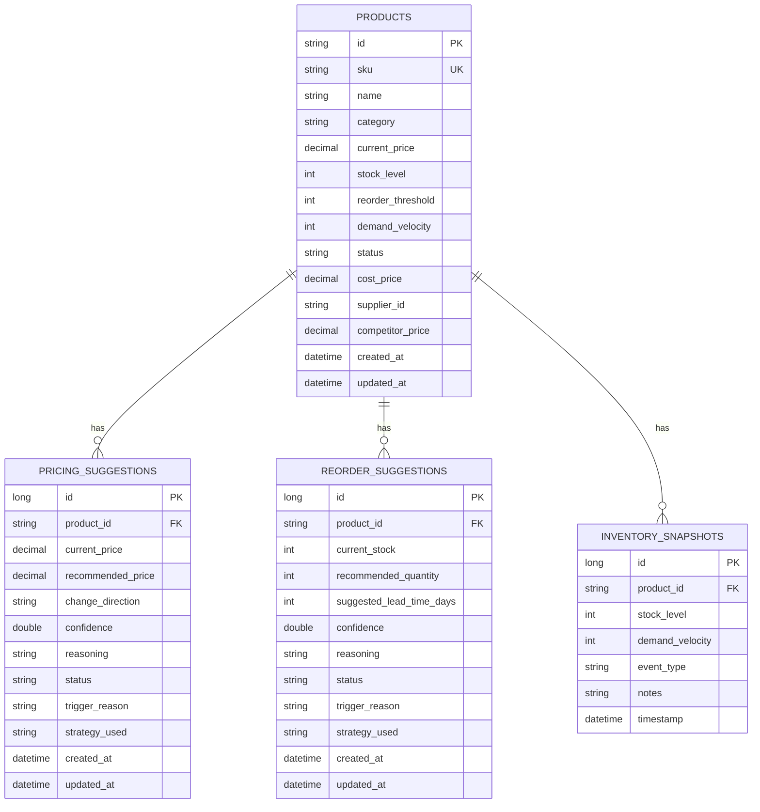
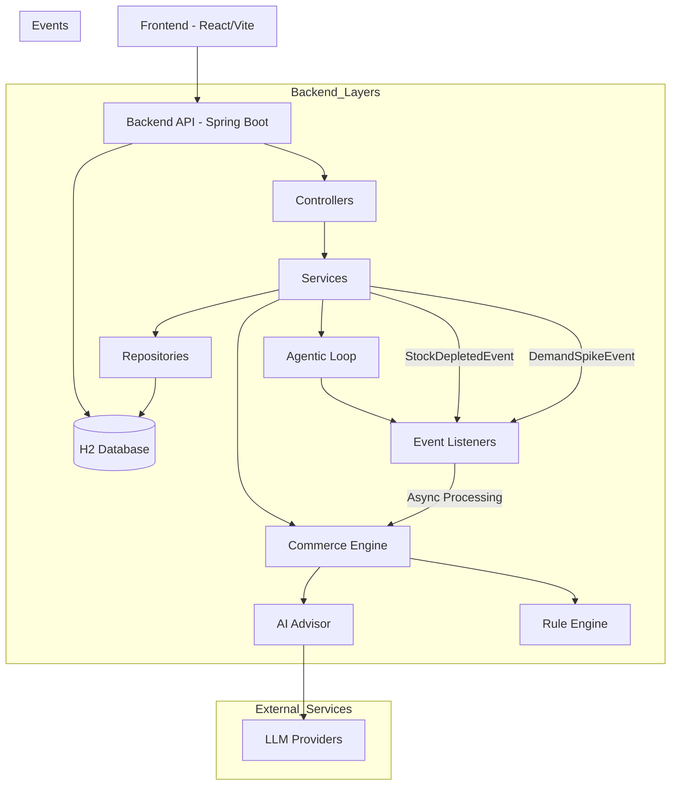

## 📊 Entity Relationship Diagram (Visual)

```mermaid
erDiagram
    PRODUCTS {
        string id PK
        string sku UK
        string name
        string category
        decimal current_price
        int stock_level
        int reorder_threshold
        int demand_velocity
        string status
        decimal cost_price
        string supplier_id
        decimal competitor_price
        datetime created_at
        datetime updated_at
    }
    
    PRICING_SUGGESTIONS {
        long id PK
        string product_id FK
        decimal current_price
        decimal recommended_price
        string change_direction
        double confidence
        string reasoning
        string status
        string trigger_reason
        string strategy_used
        datetime created_at
        datetime updated_at
    }
    
    REORDER_SUGGESTIONS {
        long id PK
        string product_id FK
        int current_stock
        int recommended_quantity
        int suggested_lead_time_days
        double confidence
        string reasoning
        string status
        string trigger_reason
        string strategy_used
        datetime created_at
        datetime updated_at
    }
    
    INVENTORY_SNAPSHOTS {
        long id PK
        string product_id FK
        int stock_level
        int demand_velocity
        string event_type
        string notes
        datetime timestamp
    }
    
    PRODUCTS ||--o{ PRICING_SUGGESTIONS : has
    PRODUCTS ||--o{ REORDER_SUGGESTIONS : has
    PRODUCTS ||--o{ INVENTORY_SNAPSHOTS : has
```

## 🏛️ System Architecture Diagram

```mermaid
graph TD
    A[Frontend - React/Vite] --> B[Backend API - Spring Boot]
    B --> C[(H2 Database)]
    
    subgraph Backend_Layers
        B --> D[Controllers]
        D --> E[Services]
        E --> F[Repositories]
        F --> C
        E --> G[Commerce Engine]
        G --> H[AI Advisor]
        G --> I[Rule Engine]
        E --> J[Agentic Loop]
        J --> K[Event Listeners]
    end
    
    subgraph External_Services
        H --> L[LLM Providers]
    end
    
    subgraph Events
        E -->|StockDepletedEvent| K
        E -->|DemandSpikeEvent| K
        K -->|Async Processing| G
    end
```