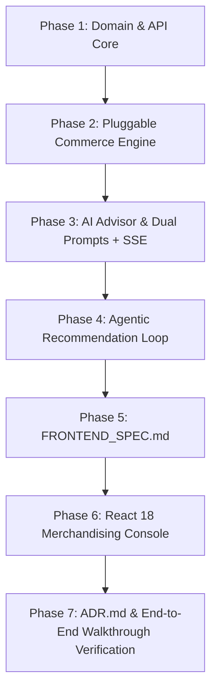

# StockPulse · AI Inventory & Dynamic Pricing
## Master Architecture & Implementation Plan

### 1. Overview
ShopStream's StockPulse is an agentic reactive commerce advisor designed to solve the lag between inventory/velocity signals and pricing/replenishment decisions. The system operates on an **Observe → Reason → Act → Checkpoint** loop:
- **Observe**: Inventory drop (`PATCH /products/{id}/stock` or `POST /products/{id}/orders`) or demand velocity spike.
- **Reason**: AI Commerce Advisor evaluates stock levels, peer category averages, and trigger-specific contexts with dedicated prompts (Low Stock vs Demand Spike) and sanity validation.
- **Act**: System queues `PricingSuggestion` and `ReorderSuggestion` asynchronously without blocking HTTP response.
- **Checkpoint**: Merchandising console displays suggestions with AI reasoning and badges; human merchandiser approves or rejects before live prices or purchase orders take effect.

---

### 2. Scorecard Target (118/118 pts + Extensions)
| Area | Task | Points | Key Deliverables |
|---|---|---|---|
| Domain & API | T-1 | 20 pts | Entities (`Product`, `PricingSuggestion`, `ReorderSuggestion`, `InventorySnapshot`), State machines, Sprint 2 placeholders (`costPrice`, `supplierId`, `competitorPrice`), 8 seeded products |
| Commerce Engine | T-2 | 25 pts | `PricingStrategy`, `ReorderStrategy`, rule-based implementations, `StrategyRegistry` switchable at runtime via API without restart |
| AI Advisor | T-3 | 25 pts + 5 pts | `LLMGateway` (Gemini, Groq, Ollama, OpenAI-compat + resilient mock fallback), 2 distinct prompts, bounds validation, SSE token stream (`/products/{id}/suggest-pricing/stream`) |
| Agentic Loop | T-4 | 15 pts | Spring Event decoupling (`@EventListener` + `@Async`), `INVENTORY_LOW` and `DEMAND_SPIKE` triggers, deduplication, rule-based fallback on AI failure |
| Merchandising Console | T-5 | 12 + 8 pts | React 18 UI, Pending suggestions board, accept/reject, trigger badges, simulate sale/spike actions, full catalog table, live strategy switcher, SSE stream drawer |
| ADR & Walkthrough | T-6 | 20 pts | `ADR.md` covering 6 critical architectural decisions with trade-offs, and step-by-step walkthrough guide |

---

### 3. Phased Execution Roadmap

#### Phase 1: Domain & API Core (T-1)
- Configure `pom.xml`: Add H2 database dependency (alongside MySQL) to guarantee zero-config immediate run, Jackson, validation.
- Define Entities:
  - `Product`: with status `ACTIVE`, `PRICE_REVIEW_PENDING`, `OUT_OF_STOCK`, and Sprint 2 nullable fields `costPrice`, `supplierId`, `competitorPrice`.
  - `PricingSuggestion`: with `changeDirection` (`INCREASE`, `DECREASE`, `HOLD`), `confidence`, `reasoning`, `status` (`PENDING`, `ACCEPTED`, `REJECTED`), `triggerReason` (`INITIAL`, `INVENTORY_LOW`, `DEMAND_SPIKE`, `MANUAL`).
  - `ReorderSuggestion`: with `recommendedQuantity`, `suggestedLeadTimeDays`, `confidence`, `reasoning`, `status`, `triggerReason`.
  - `InventorySnapshot`: recording audit log of stock & velocity transitions.
- Seed Data: Preload Addendum A (8 items: PRD-001 to PRD-008) via automated DataInitializer.
- REST Controllers & Services for Products and Suggestions with state transition logic.

#### Phase 2: Pluggable Commerce Engine (T-2)
- Define clean contracts: `PricingStrategy` and `ReorderStrategy`.
- Implement `RuleBasedPricingStrategy`:
  - If stock < threshold: +10% price.
  - If velocity > 2x category avg: +5% price.
  - Else: HOLD.
- Implement `RuleBasedReorderStrategy`:
  - Quantity = `max(1, (reorderThreshold * 3) - currentStock)`.
- Implement `StrategyRegistry` and `CommerceAdvisorCoordinator` allowing dynamic runtime strategy switching (Rule-based vs AI) without app restart.

#### Phase 3: AI Commerce Advisor & SSE Bonus (T-3)
- Implement `LLMGateway` supporting Gemini, Groq, Ollama, OpenAI-compatible with timeout protection.
- Implement two distinct prompt templates:
  - `InventoryLowPrompt`: Scarcity vs clearance analysis, margin protection vs holding costs.
  - `DemandSpikePrompt`: Viral momentum capitalization, elastic demand, peer category velocity benchmark.
- Bounds and sanity validator: Ensure positive price, 0.5x–2.5x current price boundaries, positive integer reorders, 0.0–1.0 confidence.
- Graceful Fallback: If LLM is unavailable, times out, or fails parsing, seamlessly fall back to rule-based recommendations.
- SSE Endpoint: `POST /products/{id}/suggest-pricing/stream` streaming tokens of reasoning before final suggestion.

#### Phase 4: Agentic Recommendation Loop (T-4)
- `StockChangedEvent` and `DemandSpikeEvent` published upon stock PATCH or order creation.
- Async listener `AgenticRecommendationListener` processes triggers in background.
- Idempotency guard: Deduplicate suggestions so multiple quick orders don't spam duplicate pending suggestions for the same product and trigger.
- Acceptance handlers:
  - Accepting pricing suggestion atomically updates `product.currentPrice` and resets status to `ACTIVE`.
  - Accepting reorder suggestion simulates inbound replenishment (`product.stockLevel += recommendedQuantity`) and updates status.

#### Phase 5: `FRONTEND_SPEC.md`
- Comprehensive specification containing:
  - Exact JSON payloads for all endpoints (GET, POST, PATCH, SSE).
  - DTO schema definitions and TypeScript types.
  - UI state requirements and wireframes.
  - Prompts for frontend development.

#### Phase 6: Merchandising Console (React 18 + Vite) (T-5)
- Modern executive commerce dashboard:
  - Real-time status indicators and auto-refresh/polling.
  - Pending Suggestions Board with AI reasoning cards, confidence bars, and INVENTORY_LOW vs DEMAND_SPIKE badges.
  - Accept and Reject action controls with instant UI feedback.
  - "Simulate Sale" (-1 stock, +1 velocity) and "Simulate Viral Spike" (+10 velocity) buttons on each SKU for instant live hackathon demo!
  - Strategy switcher toggle (Rule-Based vs AI).
  - Live AI Token Stream drawer demonstrating the SSE bonus.
  - Sprint 2 extension drawer/modal showing Supplier and Competitor price fields.

#### Phase 7: ADR.md & Documentation (T-6)
- Complete Architectural Decision Record with the 6 mandatory entries:
  1. Commerce logic placement.
  2. Unified vs Split contracts.
  3. Runtime strategy switching.
  4. LLM failure handling & fallback.
  5. Agentic loop trigger and decoupling.
  6. Extensibility and sprint 2 exclusions.
- Step-by-step walkthrough demo script.
