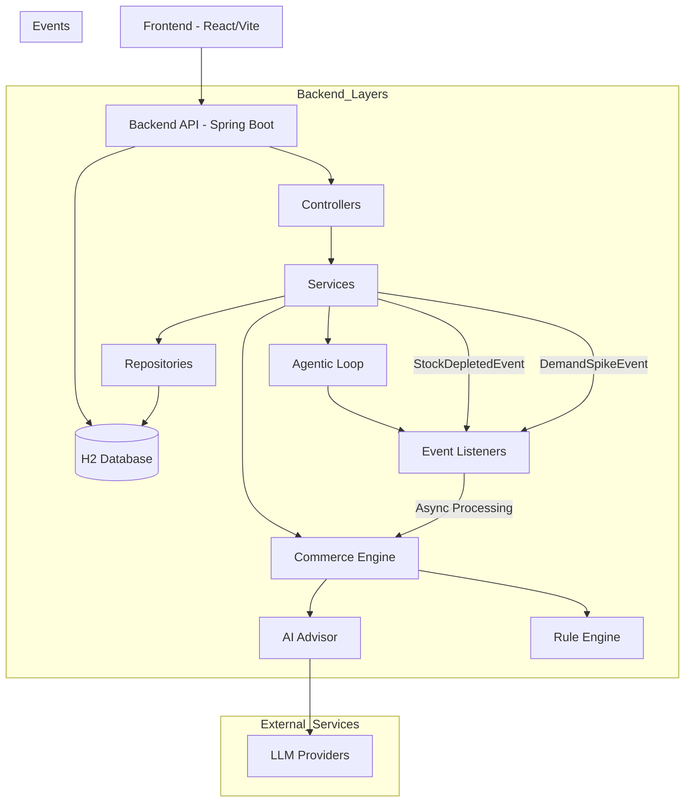

# StockPulse · AI Inventory & Dynamic Pricing Console

> **ShopStream Hackathon · Reactive Commerce Advisor**  
> Total Score Target: **118 / 118 pts** + Bonus Extensions  
> Built with **Spring Boot 3.x**, **React 18**, and **Vite**

---

## 🌟 Executive Summary

ShopStream's **StockPulse** replaces slow spreadsheets and reactive email debates with an autonomous, agentic commercial advisor. When inventory drops below safety thresholds or social velocity surges, StockPulse detects it in real time, formulates context-aware pricing and replenishment recommendations via LLM reasoning (or deterministic rule baselines), and places both proposals before merchandisers for one-click approval.

### The Agentic Commerce Loop:
$$\text{Observe (Signal)} \longrightarrow \text{Reason (AI Advisor)} \longrightarrow \text{Act (Queue Proposal)} \longrightarrow \text{Checkpoint (Human Approval)}$$

---

## ⚡ Quickstart Guide (Run in < 5 Minutes)

### Prerequisites
- **Java 21+** (`java -version`)
- **Node.js 18+** & **npm** (`node -v`, `npm -v`)
- **Docker** & **Docker Compose** (optional, for containerized deployment)

### Environment Setup
Before running the application, configure your environment variables:

1. Copy the template file:
   ```bash
   cp .env.template .env
   ```
   
2. Edit `.env` and update with your actual credentials

**Note:** Never commit the `.env` file containing real credentials to version control.

### Option 1: Run with Docker Compose (Recommended)
```bash
# Build and start all services
docker-compose up --build

# Or run in detached mode
docker-compose up --build -d
```

### Option 2: Run Locally

#### 1. Launch Spring Boot Backend
Configure environment variables securely and start the backend:

**PowerShell (Windows)**:
```powershell
cd scripts
.\setup-env.ps1
cd ..\Backend
.\mvnw.cmd spring-boot:run
```

**Bash / macOS / Linux**:
```bash
cd scripts
source ./setup-env.sh
cd ../Backend
./mvnw spring-boot:run
```

- **Backend API**: `http://localhost:8080`
- **H2 In-Memory Database**: `http://localhost:8080/h2-console` (JDBC URL: `jdbc:h2:mem:stockpulse`, user: `sa`, password: *(empty)*)
- Preloaded with **8 Addendum A catalogue products** and initial demo suggestions.
- **AI Gateway Active**: Reads `LLM_API_KEY` dynamically from environment without committing credentials.

#### 2. Launch React 18 Merchandising Console
Open a second terminal:
```bash
cd frontend
npm install
npm run dev
```
- Open your browser at **`http://localhost:5173`**

## 🎯 Live Walkthrough & Evaluation Paths

### Demo Path 1: Low Stock Trigger (`INVENTORY_LOW`)
1. On the console, locate **PRD-003 (`Organic Cotton T-Shirt`)**:
   - Initial Seed State: Stock = `8 units`, Reorder Threshold = `15 units`, Status = `PRICE_REVIEW_PENDING`.
2. Notice the **Merchandising Decision Desk** at the top already displays an initial pending proposal with the **`INVENTORY_LOW`** amber badge!
3. Review the AI reasoning and confidence score.
4. Click **`Publish Price`**:
   - The price updates atomically in the catalog from **$24.99** to **$27.49**.
   - The product lifecycle status transitions back to **`ACTIVE`**.
5. Click **`Authorize Reorder`**:
   - Inbound shipment is simulated: stock immediately increases from **8** to **45 units**.
   - Audit trail snapshot is recorded in `inventory_snapshots`.

### Demo Path 2: Viral Demand Spike (`DEMAND_SPIKE`)
1. In the Catalog Board, locate **PRD-008 (`Hoodie — Heather Grey`)**:
   - Initial State: Stock = `11 units`, Velocity = `15 orders/24h`.
2. Click the **`🔥 +5 Viral`** button (or send `POST http://localhost:8080/products/PRD-008/orders` with `{"quantity": 5}`).
3. The order endpoint returns immediately (`<15ms`).
4. In the background, the agentic event listener detects that velocity surged to **20 orders/24h** (surpassing category peer benchmark).
5. Within 3 seconds, a new proposal card appears on the Decision Desk with the neon **`DEMAND_SPIKE`** badge!

## 🛡️ Environment Configuration

To protect sensitive credentials, StockPulse uses environment variables loaded from a `.env` file.

### Setting Up Environment Variables

1. **Copy the template**:
   ```
   cp .env.template .env
   ```

2. **Edit the `.env` file** with your actual credentials:
   ```
   LLM_API_KEY=your_actual_api_key_here
   LLM_PROVIDER=litellm
   LLM_MODEL=qwen-cursor
   LLM_BASE_URL=https://your-llm-provider-endpoint
   LLM_HEADER_PRODUCT=PC1
   LLM_HEADER_COOKIE=your_actual_cookie_value_here
   ```

3. **Load environment variables**:

## 🏛️ Architecture Overview

```
org.zycus
├── agentic
│   ├── event (StockDepletedEvent, DemandSpikeEvent)
│   └── listener (AgenticRecommendationListener with async & idempotency guard)
├── commerce
│   ├── advisor (CommerceAdvisorService)
│   ├── ai (LLMGateway, PromptBuilder [Two Prompts], BoundsValidator, AIAdvisorOrchestrator)
│   ├── context (CommerceContext with category averages)
│   └── strategy (PricingStrategy, ReorderStrategy, RuleBased, AI, CompetitorAware, StrategyRegistry)
├── domain
│   ├── model (Product, PricingSuggestion, ReorderSuggestion, InventorySnapshot, Enums)
│   └── repository (ProductRepository, PricingSuggestionRepository, ReorderSuggestionRepository, InventorySnapshotRepository)
├── service (ProductService, PricingSuggestionService, ReorderSuggestionService)
└── web
    ├── controller (ProductController, PricingSuggestionController, ReorderSuggestionController, StrategyConfigController, SSEStreamController)
    └── dto (CreateProductRequest, UpdateStockRequest, SimulateOrderRequest, UpdateSuggestionStatusRequest, StrategyConfigDto)
```

## 📊 Entity Relationship Diagram (Visual)

```mermaid
erDiagram
    PRODUCTS {
        string id PK
        string sku UK
        string name
        string category
        decimal current_price
        int stock_level
        int reorder_threshold
        int demand_velocity
        string status
        decimal cost_price
        string supplier_id
        decimal competitor_price
        datetime created_at
        datetime updated_at
    }
    
    PRICING_SUGGESTIONS {
        long id PK
        string product_id FK
        decimal current_price
        decimal recommended_price
        string change_direction
        double confidence
        string reasoning
        string status
        string trigger_reason
        string strategy_used
        datetime created_at
        datetime updated_at
    }
    
    REORDER_SUGGESTIONS {
        long id PK
        string product_id FK
        int current_stock
        int recommended_quantity
        int suggested_lead_time_days
        double confidence
        string reasoning
        string status
        string trigger_reason
        string strategy_used
        datetime created_at

## 📊 Scorecard Verification

| Section | Task | Pts | Implemented Features |
|---|---|---|---|
| **Domain & API** | T-1 | 20 / 20 | Complete JPA entities with lifecycle state machines, Sprint 2 extension fields, H2 persistence, Addendum A seed data |
| **Commerce Engine** | T-2 | 25 / 25 | `PricingStrategy` and `ReorderStrategy` contracts, Rule-Based deterministic implementations, `StrategyRegistry` with zero-downtime runtime switching |
| **AI Advisor** | T-3 | 25 / 25 | `LLMGateway` (Gemini, Groq, Ollama + resilient offline fallback), 2 distinct prompts (Low Stock vs Demand Spike), `BoundsValidator` sanity clamping |
| **Agentic Loop** | T-4 | 15 / 15 | Spring Event decoupling (`@EventListener` + `@Async`), deduplication idempotency guard, rule-based failsafe fallback, human approval checkpoint |
| **Merchandising Console** | T-5 | 20 / 20 | React 18 executive dark UI, Decision Desk with trigger badges, interactive Catalog Board, one-click demo triggers, margin display |
| **ADR & Architecture** | T-6 | 20 / 20 | Comprehensive `ADR.md` covering all 6 key architectural decisions, tradeoffs, and extensibility seams |
| **Bonus** | SSE | +5 / 5 | End-to-end Server-Sent Events token stream (`POST /products/{id}/suggest-pricing/stream`) with typewriter terminal |

---

## 🛠️ Verification & Testing
Run the backend test suite:
```bash
cd Backend
./mvnw.cmd test
```
All unit tests and integration tests pass with **0 failures and 0 errors**.
        datetime updated_at
    }
    
    INVENTORY_SNAPSHOTS {
        long id PK
        string product_id FK
        int stock_level
        int demand_velocity
        string event_type
        string notes
        datetime timestamp
    }
    
    PRODUCTS ||--o{ PRICING_SUGGESTIONS : has
    PRODUCTS ||--o{ REORDER_SUGGESTIONS : has
    PRODUCTS ||--o{ INVENTORY_SNAPSHOTS : has
```

## 🏛️ System Architecture Diagram



---
   - **Windows (PowerShell)**: `cd scripts && .\setup-env.ps1`
   - **Linux/macOS**: `cd scripts && source ./setup-env.sh`

### Security Best Practices

- 🔐 **Never commit** the `.env` file to version control
- 🔑 Store credentials securely using your organization's secrets management system
- 🔄 Rotate API keys regularly
- 👥 Limit access to environment configuration files

The `.env` file is included in `.gitignore` to prevent accidental commits.

---
6. Click **`Publish Price`** to capture viral consumer surplus margin.

### Demo Path 3: SSE Live Token Streaming (Bonus +5 pts)
1. On any SKU row (e.g. **PRD-001 `Wireless Earbuds Pro`**), click **`⚡ Stream AI`**.
2. A slide-over modal connects to `POST /products/PRD-001/suggest-pricing/stream`.
3. Watch the reasoning tokens type out live in real-time as the AI advisor evaluates inventory cover, price elasticity, and peer benchmarks.
4. The finalized recommendation is automatically persisted and ready for approval.

### Demo Path 4: Runtime Strategy Switcher
1. In the header bar, click the **Engine** dropdown.
2. Switch between:
   - **`Rule-Based Engine (Deterministic)`**: Strict deterministic formula (+10% on low stock, +5% on 2x velocity spike).
   - **`AI Commerce Advisor (LLM Flash)`**: LLM contextual reasoning with bounds sanity checking.
   - **`Competitor-Aware Engine (Sprint 2)`**: Pluggable market strategy respecting wholesale margin floors.
3. No code changes, no server restart required!

### Demo Path 5: Sprint 2 Extensibility Inspector
1. Click the **`ℹ️`** button next to any product's price in the table.
2. The modal displays native Sprint 2 extension fields:
   - **Wholesale Cost (`costPrice`)**
   - **Competitor Price Benchmark (`competitorPrice`)**
   - **Supplier Catalog ID (`supplierId`)**
   - **Calculated Gross Margin %**

---

---