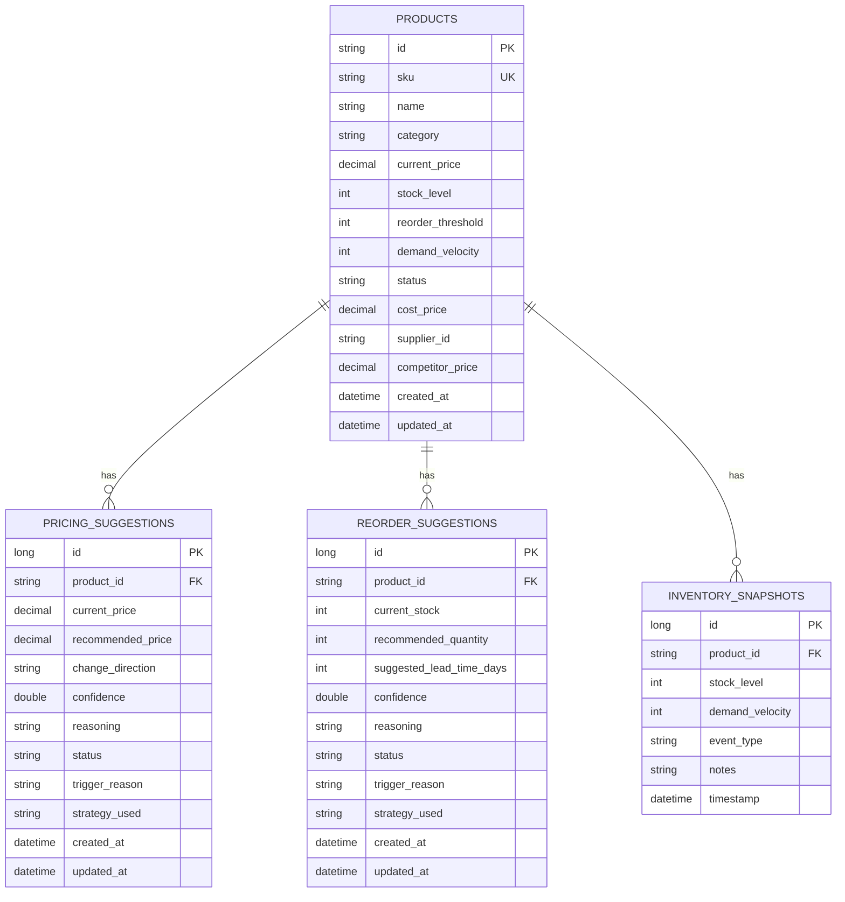
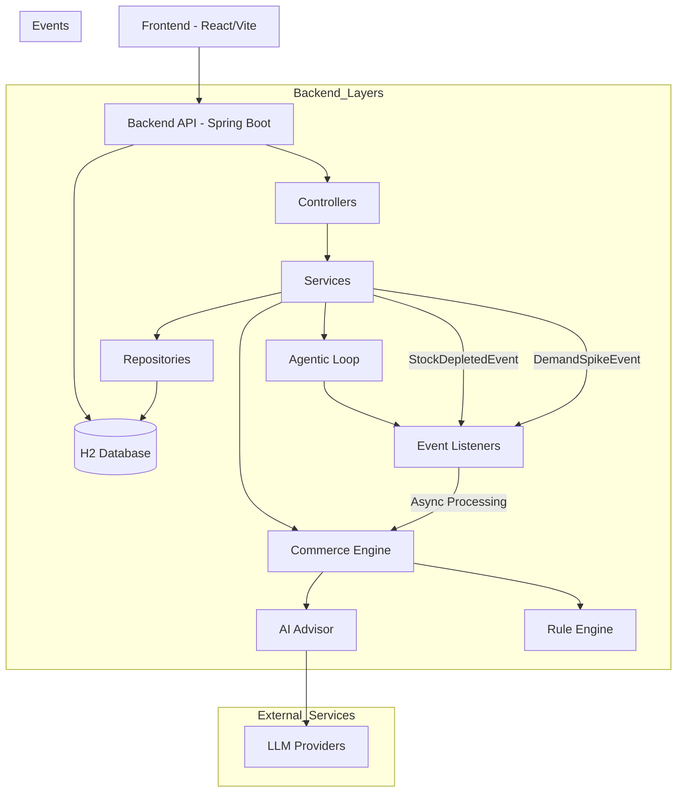

# StockPulse · AI Inventory & Dynamic Pricing Console

> **ShopStream Hackathon · Reactive Commerce Advisor**
> Built with **Spring Boot 3.x**, **React 18**, and **Vite**

---

## 🌟 Executive Summary

ShopStream's **StockPulse** replaces slow spreadsheets and reactive email debates with an autonomous, agentic commercial advisor. When inventory drops below safety thresholds or social velocity surges, StockPulse detects it in real time, formulates context-aware pricing and replenishment recommendations via LLM reasoning (or deterministic rule baselines), and places both proposals before merchandisers for one-click approval.

### The Agentic Commerce Loop

\(\text{Observe (Signal)} \longrightarrow \text{Reason (AI Advisor)} \longrightarrow \text{Act (Queue Proposal)} \longrightarrow \text{Checkpoint (Human Approval)}\)

---

## ⚡ Quickstart Guide

### Prerequisites

* **Java 21+** (`java -version`)
* **Node.js 18+** & **npm** (`node -v`, `npm -v`)
* **Docker** & **Docker Compose** *(optional, for containerized deployment)*

### Environment Setup

Before running the application, configure your environment variables.

1. Copy the template file:

```bash
cp .env.template .env
```

2. Edit `.env` and update it with your actual credentials.

> **Note:** Never commit the `.env` file containing real credentials to version control.

### Option 1: Run with Docker Compose

```bash
# Build and start all services
docker-compose up --build

# Or run in detached mode
docker-compose up --build -d
```

### Option 2: Run Locally

#### 1. Launch Spring Boot Backend

Configure environment variables securely and start the backend.

**PowerShell (Windows):**

```powershell
.\setup-env.ps1
cd Backend
.\mvnw.cmd spring-boot:run
```

**Bash / macOS / Linux:**

```bash
source ./setup-env.sh
cd Backend
./mvnw spring-boot:run
```

Backend services:

* **Backend API:** `http://localhost:8080`
* **H2 Console:** `http://localhost:8080/h2-console`
* **JDBC URL:** `jdbc:h2:mem:stockpulse`
* **Username:** `sa`
* **Password:** *(empty)*
* Preloaded with **8 Addendum A catalogue products** and initial demo suggestions.
* **AI Gateway:** Reads `LLM_API_KEY` dynamically from the environment without committing credentials.

#### 2. Launch React 18 Merchandising Console

Open a second terminal:

```bash
cd Frontend
npm install
npm run dev
```

Open the frontend at:

```text
http://localhost:5173
```

---

## 🎯 Live Walkthrough & Evaluation Paths

### Demo Path 1: Low Stock Trigger (`INVENTORY_LOW`)

1. On the console, locate **PRD-003 (`Organic Cotton T-Shirt`)**.
2. Initial seed state:

   * Stock = `8 units`
   * Reorder Threshold = `15 units`
   * Status = `PRICE_REVIEW_PENDING`
3. The **Merchandising Decision Desk** displays an initial pending proposal with the `INVENTORY_LOW` badge.
4. Review the AI reasoning and confidence score.
5. Click **`Publish Price`**:

   * Price updates atomically from **$24.99** to **$27.49**.
   * Product lifecycle status transitions back to **`ACTIVE`**.
6. Click **`Authorize Reorder`**:

   * Inbound shipment is simulated.
   * Stock increases from **8** to **45 units**.
   * An audit trail snapshot is recorded in `inventory_snapshots`.

### Demo Path 2: Viral Demand Spike (`DEMAND_SPIKE`)

1. In the Catalog Board, locate **PRD-008 (`Hoodie — Heather Grey`)**.
2. Initial state:

   * Stock = `11 units`
   * Velocity = `15 orders/24h`
3. Click the **`🔥 +5 Viral`** button or send:

```http
POST http://localhost:8080/products/PRD-008/orders
Content-Type: application/json

{
  "quantity": 5
}
```

4. The order endpoint returns immediately (`<15ms`).
5. In the background, the agentic event listener detects that velocity surged to **20 orders/24h**, surpassing the category peer benchmark.
6. Within approximately 3 seconds, a new proposal card appears on the Decision Desk with the `DEMAND_SPIKE` badge.
7. Click **`Publish Price`** to apply the recommendation.

### Demo Path 3: SSE Live Token Streaming

1. On any SKU row, such as **PRD-001 (`Wireless Earbuds Pro`)**, click **`⚡ Stream AI`**.
2. The console connects to:

```text
POST /products/PRD-001/suggest-pricing/stream
```

3. AI reasoning tokens are streamed live in real time.
4. The finalized recommendation is automatically persisted and becomes available for approval.

### Demo Path 4: Runtime Strategy Switcher

1. In the header bar, open the **Engine** dropdown.
2. Switch between:

* **Rule-Based Engine (Deterministic)**

  * Strict deterministic formula.
  * `+10%` on low stock.
  * `+5%` on a 2x velocity spike.
* **AI Commerce Advisor (LLM Flash)**

  * LLM-based contextual reasoning.
  * Bounds sanity checking.
* **Competitor-Aware Engine**

  * Pluggable market strategy.
  * Respects wholesale margin floors.

3. Strategy changes require **no code changes and no server restart**.

### Demo Path 5: Sprint 2 Extensibility Inspector

1. Click the **`ℹ️`** button next to any product's price.
2. The modal displays:

* **Wholesale Cost** (`costPrice`)
* **Competitor Price Benchmark** (`competitorPrice`)
* **Supplier Catalog ID** (`supplierId`)
* **Calculated Gross Margin %**

---

## 🛡️ Environment Configuration

StockPulse uses environment variables loaded from a `.env` file to protect sensitive credentials.

### Setting Up Environment Variables

1. **Copy the template:**

```bash
cp .env.template .env
```

2. **Edit the `.env` file:**

```env
LLM_API_KEY=your_actual_api_key_here
LLM_PROVIDER=litellm
LLM_MODEL=qwen-cursor
LLM_BASE_URL=https://your-llm-provider-endpoint
LLM_HEADER_PRODUCT=PC1
LLM_HEADER_COOKIE=your_actual_cookie_value_here
```

3. **Load environment variables:**

**Windows (PowerShell):**

```powershell
.\setup-env.ps1
```

**Linux/macOS:**

```bash
source ./setup-env.sh
```

### Security Best Practices

* 🔐 **Never commit** the `.env` file to version control.
* 🔑 Store credentials securely using your organization's secrets management system.
* 🔄 Rotate API keys regularly.
* 👥 Limit access to environment configuration files.

The `.env` file is included in `.gitignore` to prevent accidental commits.

---

## 🏛️ Architecture Overview

```text
org.zycus
├── agentic
│   ├── event
│   │   ├── StockDepletedEvent
│   │   └── DemandSpikeEvent
│   └── listener
│       └── AgenticRecommendationListener
│           └── Async processing + idempotency guard
│
├── commerce
│   ├── advisor
│   │   └── CommerceAdvisorService
│   ├── ai
│   │   ├── LLMGateway
│   │   ├── PromptBuilder
│   │   ├── BoundsValidator
│   │   └── AIAdvisorOrchestrator
│   ├── context
│   │   └── CommerceContext
│   └── strategy
│       ├── PricingStrategy
│       ├── ReorderStrategy
│       ├── RuleBased
│       ├── AI
│       ├── CompetitorAware
│       └── StrategyRegistry
│
├── domain
│   ├── model
│   │   ├── Product
│   │   ├── PricingSuggestion
│   │   ├── ReorderSuggestion
│   │   ├── InventorySnapshot
│   │   └── Enums
│   └── repository
│       ├── ProductRepository
│       ├── PricingSuggestionRepository
│       ├── ReorderSuggestionRepository
│       └── InventorySnapshotRepository
│
├── service
│   ├── ProductService
│   ├── PricingSuggestionService
│   └── ReorderSuggestionService
│
└── web
    ├── controller
    │   ├── ProductController
    │   ├── PricingSuggestionController
    │   ├── ReorderSuggestionController
    │   ├── StrategyConfigController
    │   └── SSEStreamController
    └── dto
        ├── CreateProductRequest
        ├── UpdateStockRequest
        ├── SimulateOrderRequest
        ├── UpdateSuggestionStatusRequest
        └── StrategyConfigDto
```

---

## 📊 Entity Relationship Diagram

The StockPulse persistence layer is centered around the `PRODUCTS` entity. Pricing recommendations, reorder recommendations, and inventory history are associated with individual products.



### Relationship Summary

| Relationship                     | Cardinality | Description                                                 |
| -------------------------------- | ----------- | ----------------------------------------------------------- |
| `PRODUCTS → PRICING_SUGGESTIONS` | `1 : N`     | A product can have multiple pricing recommendations.        |
| `PRODUCTS → REORDER_SUGGESTIONS` | `1 : N`     | A product can have multiple reorder recommendations.        |
| `PRODUCTS → INVENTORY_SNAPSHOTS` | `1 : N`     | A product can have multiple historical inventory snapshots. |

> **Note:** `category`, `status`, and `trigger_reason` are represented as application-level enums rather than separate database tables.

---

## 🏛️ System Architecture Diagram



---

## 🚀 Implemented Features

### Domain & Inventory Management

* Complete JPA domain model for products, pricing suggestions, reorder suggestions, and inventory snapshots.
* Product lifecycle states including `ACTIVE`, `PRICE_REVIEW_PENDING`, and `OUT_OF_STOCK`.
* Product SKU uniqueness validation.
* Inventory tracking with stock level, reorder threshold, and demand velocity.
* Sprint 2 product extensions for wholesale cost, supplier catalog ID, and competitor pricing.
* H2 database persistence for local development and demonstration.
* Preloaded catalogue products and initial recommendation data.

### Dynamic Pricing Engine

* Pluggable `PricingStrategy` interface for pricing recommendation generation.
* Deterministic rule-based pricing strategy.
* AI-powered contextual pricing recommendations.
* Competitor-aware pricing strategy.
* Runtime strategy switching without application restart.
* Price bounds validation and sanity checking.
* Pricing recommendations include confidence, reasoning, trigger reason, and strategy metadata.

### Reorder Recommendation Engine

* Dedicated `ReorderStrategy` abstraction.
* Rule-based inventory replenishment recommendations.
* AI-assisted reorder recommendations.
* Recommended quantity and lead-time calculation.
* Reorder suggestions connected directly to product inventory state.

### AI Commerce Advisor

* Centralized `LLMGateway` abstraction for LLM providers.
* Support for **Gemini, Groq, and Ollama** providers.
* Offline/rule-based fallback when an external LLM is unavailable.
* Separate prompts for low-stock and demand-spike scenarios.
* Context-aware reasoning using commerce data and category averages.
* `BoundsValidator` to prevent unsafe or unrealistic AI-generated recommendations.

### Agentic Event-Driven Workflow

* Spring application events for inventory and demand signals.
* `StockDepletedEvent` for low inventory conditions.
* `DemandSpikeEvent` for abnormal demand velocity.
* Asynchronous recommendation processing using `@Async`.
* Idempotency guard to prevent duplicate recommendation processing.
* Rule-based fallback for resilient recommendation generation.
* Human approval checkpoint before recommendations are applied.

### Merchandising Console

* React 18 + Vite merchandising interface.
* Executive-style dark UI.
* Interactive Catalog Board.
* Merchandising Decision Desk.
* Trigger badges for `INVENTORY_LOW` and `DEMAND_SPIKE`.
* AI reasoning and confidence visibility.
* One-click price publishing.
* One-click reorder authorization.
* Interactive demo triggers for testing inventory and demand scenarios.
* Gross margin visibility.

### Real-Time AI Streaming

* Server-Sent Events implementation for AI recommendation streaming.
* Live AI reasoning token display.
* Streaming endpoint:

```text
POST /products/{id}/suggest-pricing/stream
```

* Final recommendation automatically persisted after streaming completes.

### Extensibility & Architecture

* Strategy Pattern for pricing and reorder engines.
* Runtime `StrategyRegistry` for selecting active strategies.
* Separation of controller, service, domain, repository, commerce, and agentic layers.
* DTO-based API boundary.
* Dedicated repository layer using Spring Data JPA.
* Event-driven separation between business operations and recommendation processing.
* Architecture documented through `ADR.md`.

### Security & Configuration

* Environment-based configuration for LLM credentials.
* `.env` excluded through `.gitignore`.
* Credentials are not hardcoded into the application.
* Runtime loading of LLM configuration.
* Dedicated environment setup scripts for Windows and Unix-based systems.

### Testing & Verification

* Backend unit and integration test suite.
* Maven-based test execution.
* Verification of core business and API functionality.
* Test suite reports **0 failures and 0 errors**.

---

## 🛠️ Verification & Testing

Run the backend test suite:

```bash
cd Backend
./mvnw.cmd test
```

The project test suite completes with **0 failures and 0 errors**.
