# 📚 TEACH.md — StockPulse Complete Learning Guide

> **A comprehensive, beginner-to-advanced tutorial for understanding every layer of the StockPulse AI Inventory & Dynamic Pricing system.**

---

## Table of Contents

1. [What Is This Project?](#1-what-is-this-project)
2. [The Big Picture — How It All Fits Together](#2-the-big-picture--how-it-all-fits-together)
3. [Technology Stack Explained](#3-technology-stack-explained)
4. [Project Folder Structure](#4-project-folder-structure)
5. [Backend Deep Dive](#5-backend-deep-dive)
   - 5.1 [Domain Layer — Entities & Enums](#51-domain-layer--entities--enums)
   - 5.2 [Repository Layer — Database Access](#52-repository-layer--database-access)
   - 5.3 [Service Layer — Business Logic](#53-service-layer--business-logic)
   - 5.4 [Web Layer — Controllers & DTOs](#54-web-layer--controllers--dtos)
   - 5.5 [Commerce Engine — Strategy Pattern](#55-commerce-engine--strategy-pattern)
   - 5.6 [AI Advisor — LLM Integration](#56-ai-advisor--llm-integration)
   - 5.7 [Agentic Loop — Event-Driven Automation](#57-agentic-loop--event-driven-automation)
   - 5.8 [SSE Streaming — Real-Time AI Output](#58-sse-streaming--real-time-ai-output)
   - 5.9 [Configuration & Data Seeding](#59-configuration--data-seeding)
6. [Frontend Deep Dive](#6-frontend-deep-dive)
   - 6.1 [React Architecture & Component Tree](#61-react-architecture--component-tree)
   - 6.2 [State Management & Polling](#62-state-management--polling)
   - 6.3 [API Service Layer](#63-api-service-layer)
   - 6.4 [Component Breakdown](#64-component-breakdown)
7. [Design Patterns Used](#7-design-patterns-used)
8. [Data Flow Walkthroughs](#8-data-flow-walkthroughs)
   - 8.1 [Flow 1: Customer Places an Order → Automatic AI Suggestion](#81-flow-1-customer-places-an-order--automatic-ai-suggestion)
   - 8.2 [Flow 2: Merchandiser Accepts a Pricing Suggestion](#82-flow-2-merchandiser-accepts-a-pricing-suggestion)
   - 8.3 [Flow 3: SSE Token Streaming](#83-flow-3-sse-token-streaming)
   - 8.4 [Flow 4: Runtime Strategy Switching](#84-flow-4-runtime-strategy-switching)
9. [Key Concepts Explained for Beginners](#9-key-concepts-explained-for-beginners)
10. [Database Schema Explained](#10-database-schema-explained)
11. [API Endpoints Reference](#11-api-endpoints-reference)
12. [How to Run the Project](#12-how-to-run-the-project)
13. [Interview-Ready Talking Points](#13-interview-ready-talking-points)
14. [Glossary](#14-glossary)

---

## 1. What Is This Project?

**StockPulse** is an **AI-powered inventory management and dynamic pricing system** built for a hackathon called "ShopStream". 

### The Real-World Problem It Solves

Imagine you run an e-commerce store with 8 products. Every day:
- Some products sell fast (high demand), and you need to **raise prices** to protect remaining stock.
- Some products run low on stock, and you need to **reorder** from suppliers.
- You're making these decisions manually using spreadsheets — **slow, error-prone, and reactive**.

### StockPulse's Solution

StockPulse **automates** this entire process using an **Agentic AI Loop**:

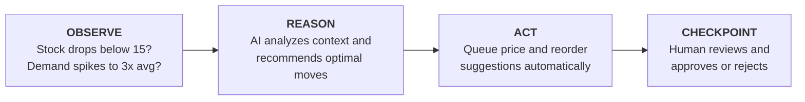

The key insight: **AI suggests, but humans approve.** No price or stock change happens without a merchandiser clicking "Accept."

---

## 2. The Big Picture — How It All Fits Together

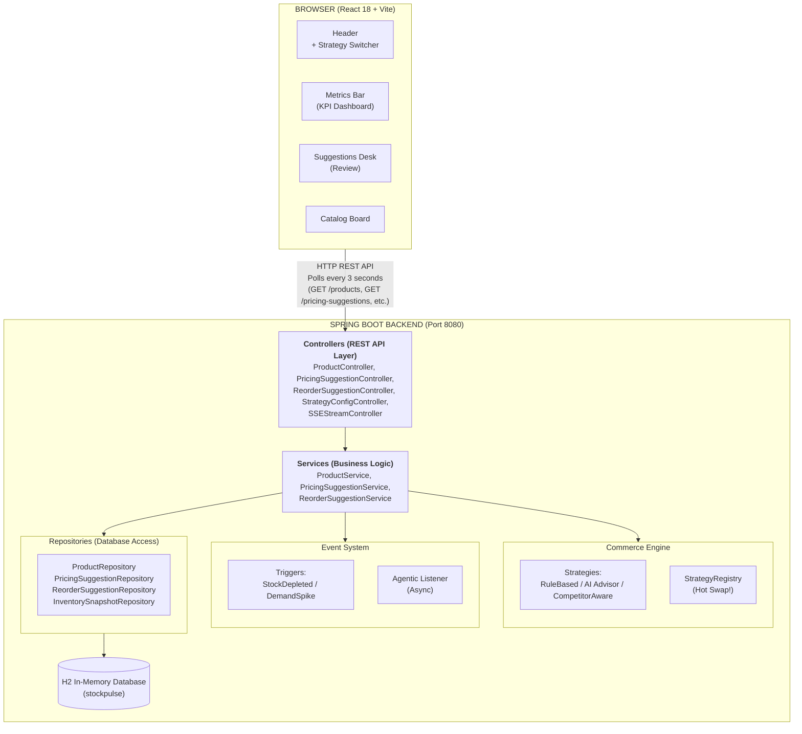

---

## 3. Technology Stack Explained

### Backend

| Technology | Version | Why It's Used |
|---|---|---|
| **Java** | 21 | Modern Java features (records, text blocks, pattern matching, virtual threads) |
| **Spring Boot** | 4.2.0-M2 | Rapid development framework — auto-configures everything |
| **Spring Data JPA** | (via Boot) | Eliminates manual SQL — write Java interfaces, get database queries free |
| **H2 Database** | (in-memory) | Zero-setup database — data lives in RAM, perfect for demos. Resets on restart. |
| **Lombok** | Latest | Eliminates boilerplate code (`@Getter`, `@Setter`, `@Builder` → no manual constructors/getters) |
| **Jackson** | (via Boot) | Converts Java objects ↔ JSON automatically |
| **Maven** | (wrapper) | Dependency management & build tool |

### Frontend

| Technology | Version | Why It's Used |
|---|---|---|
| **React** | 18.3 | Component-based UI library for building interactive interfaces |
| **Vite** | 5.4 | Lightning-fast dev server with hot module replacement (HMR) |
| **Vanilla CSS** | — | Custom styling with CSS variables for theming |
| **Fetch API** | (native) | HTTP requests to backend — no Axios needed |

### DevOps

| Technology | Why It's Used |
|---|---|
| **Docker** & **Docker Compose** | Containerize both frontend and backend for one-command deployment |
| **Nginx** | Serves the production frontend build inside Docker |

---

## 4. Project Folder Structure

```
ZYCUS-PROJECT/
│
├── .env.example            # Template for environment variables (copy to .env)
├── .env.template            # Another template with specific var names
├── .gitignore               # Prevents .env, node_modules, target/ from git
├── docker-compose.yml       # Orchestrates backend + frontend containers
├── PLAN.md                  # Architecture & implementation roadmap
├── FRONTEND_SPEC.md         # API contract & UI specification
├── README.md                # Quick start guide & feature list
│
├── scripts/
│   ├── setup-env.sh         # Linux/Mac: loads .env into shell
│   ├── setup-env.ps1        # Windows PowerShell: loads .env into shell
│   └── setup-env.bat        # Windows CMD: loads .env into shell
│
├── Backend/                 # ← SPRING BOOT APPLICATION
│   ├── pom.xml              # Maven config: dependencies & build
│   ├── mvnw / mvnw.cmd      # Maven wrapper (no global install needed)
│   ├── Dockerfile           # Container build instructions
│   └── src/
│       ├── main/
│       │   ├── java/org/zycus/
│       │   │   ├── BackendApplication.java          # 🚀 Spring Boot entry point
│       │   │   │
│       │   │   ├── domain/                          # 📦 LAYER 1: Data Models
│       │   │   │   ├── model/
│       │   │   │   │   ├── Product.java             # Central entity (SKU, price, stock)
│       │   │   │   │   ├── PricingSuggestion.java   # AI/rule price recommendation
│       │   │   │   │   ├── ReorderSuggestion.java   # AI/rule restock recommendation
│       │   │   │   │   ├── InventorySnapshot.java   # Audit trail for stock changes
│       │   │   │   │   ├── Category.java            # Enum: ELECTRONICS, APPAREL, HOME
│       │   │   │   │   ├── ProductStatus.java       # Enum: ACTIVE, PRICE_REVIEW_PENDING, OUT_OF_STOCK
│       │   │   │   │   ├── SuggestionStatus.java    # Enum: PENDING, ACCEPTED, REJECTED
│       │   │   │   │   ├── ChangeDirection.java     # Enum: INCREASE, DECREASE, HOLD
│       │   │   │   │   └── TriggerReason.java       # Enum: INITIAL, INVENTORY_LOW, DEMAND_SPIKE, MANUAL
│       │   │   │   └── repository/
│       │   │   │       ├── ProductRepository.java
│       │   │   │       ├── PricingSuggestionRepository.java
│       │   │   │       ├── ReorderSuggestionRepository.java
│       │   │   │       └── InventorySnapshotRepository.java
│       │   │   │
│       │   │   ├── service/                         # 🧠 LAYER 2: Business Logic
│       │   │   │   ├── ProductService.java          # Order simulation, stock updates, event firing
│       │   │   │   ├── PricingSuggestionService.java # Accept/reject pricing proposals
│       │   │   │   └── ReorderSuggestionService.java# Accept/reject reorder proposals
│       │   │   │
│       │   │   ├── web/                             # 🌐 LAYER 3: REST API
│       │   │   │   ├── controller/
│       │   │   │   │   ├── ProductController.java
│       │   │   │   │   ├── PricingSuggestionController.java
│       │   │   │   │   ├── ReorderSuggestionController.java
│       │   │   │   │   ├── StrategyConfigController.java
│       │   │   │   │   └── SSEStreamController.java
│       │   │   │   ├── dto/                         # Data Transfer Objects (API payloads)
│       │   │   │   │   ├── CreateProductRequest.java
│       │   │   │   │   ├── UpdateStockRequest.java
│       │   │   │   │   ├── SimulateOrderRequest.java
│       │   │   │   │   ├── UpdateSuggestionStatusRequest.java
│       │   │   │   │   ├── StrategyConfigDto.java
│       │   │   │   │   └── UpdateStrategyConfigRequest.java
│       │   │   │   └── exception/
│       │   │   │       ├── GlobalExceptionHandler.java
│       │   │   │       └── ResourceNotFoundException.java
│       │   │   │
│       │   │   ├── commerce/                        # 🏭 LAYER 4: Pricing & Reorder Engines
│       │   │   │   ├── advisor/
│       │   │   │   │   └── CommerceAdvisorService.java  # Coordinator: picks strategy, saves result
│       │   │   │   ├── strategy/
│       │   │   │   │   ├── PricingStrategy.java         # Interface (contract)
│       │   │   │   │   ├── ReorderStrategy.java         # Interface (contract)
│       │   │   │   │   ├── RuleBasedPricingStrategy.java # Deterministic: +10% low stock, +5% demand
│       │   │   │   │   ├── RuleBasedReorderStrategy.java # Formula: max(1, threshold*3 - stock)
│       │   │   │   │   ├── AIPricingStrategy.java        # AI-powered via LLM
│       │   │   │   │   ├── AIReorderStrategy.java        # AI-powered via LLM
│       │   │   │   │   ├── CompetitorAwarePricingStrategy.java  # Market-aware pricing
│       │   │   │   │   ├── StrategyRegistry.java         # Hot-swap: switch strategies at runtime!
│       │   │   │   │   ├── PricingSuggestionResult.java  # Return type from strategy evaluation
│       │   │   │   │   └── ReorderSuggestionResult.java
│       │   │   │   ├── ai/
│       │   │   │   │   ├── LLMGateway.java               # HTTP client for LLM APIs
│       │   │   │   │   ├── PromptBuilder.java             # Constructs context-aware prompts
│       │   │   │   │   ├── BoundsValidator.java           # Safety guardrails for AI output
│       │   │   │   │   └── AIAdvisorOrchestrator.java     # Orchestrates prompt→LLM→validate→result
│       │   │   │   └── context/
│       │   │   │       └── CommerceContext.java            # Contextual data for strategy evaluation
│       │   │   │
│       │   │   ├── agentic/                         # 🤖 LAYER 5: Autonomous Event Loop
│       │   │   │   ├── event/
│       │   │   │   │   ├── StockDepletedEvent.java      # "Stock fell below threshold!"
│       │   │   │   │   └── DemandSpikeEvent.java        # "Velocity surged above 2.5x average!"
│       │   │   │   └── listener/
│       │   │   │       └── AgenticRecommendationListener.java  # Async handler: generates suggestions
│       │   │   │
│       │   │   ├── config/                          # ⚙️ Configuration
│       │   │   │   ├── AsyncConfig.java             # Enables @Async for background processing
│       │   │   │   └── WebConfig.java               # CORS configuration
│       │   │   │
│       │   │   └── init/
│       │   │       └── DataInitializer.java         # Seeds 8 products + demo suggestions on startup
│       │   │
│       │   └── resources/
│       │       └── application.properties           # Server port, DB config, LLM settings, triggers
│       │
│       └── test/                                    # Test suite
│
└── frontend/                # ← REACT APPLICATION
    ├── package.json         # Dependencies (react, react-dom, vite)
    ├── vite.config.js       # Dev server config with API proxy
    ├── index.html           # HTML shell loaded by browser
    ├── Dockerfile           # Container build (nginx for production)
    ├── nginx.conf           # Nginx reverse proxy config
    └── src/
        ├── main.jsx         # React entry point (renders <App /> into DOM)
        ├── App.jsx          # 🏠 Root component: state, polling, event handlers
        ├── index.css        # 🎨 Complete design system (22KB of custom CSS!)
        ├── components/
        │   ├── Header.jsx           # Logo, live indicator, strategy switcher
        │   ├── MetricsBar.jsx       # 4 KPI cards (pending, low stock, spikes, total)
        │   ├── SuggestionsDesk.jsx   # Pending proposals: accept/reject with AI reasoning
        │   ├── CatalogBoard.jsx     # Product table with demo action buttons
        │   ├── StreamModal.jsx      # Live SSE token streaming modal
        │   ├── ProductDetailModal.jsx# Sprint 2 fields (cost, supplier, competitor)
        │   └── Icons.jsx            # SVG icon components
        └── services/
            └── api.js               # All HTTP calls to backend (fetch wrapper)
```

---

## 5. Backend Deep Dive

### 5.1 Domain Layer — Entities & Enums

The domain layer is the **foundation** of the application. It defines **what data exists** and **how it's structured in the database**.

#### 5.1.1 The `Product` Entity — The Heart of Everything

```java
// File: Backend/src/main/java/org/zycus/domain/model/Product.java

@Entity                    // Tells JPA: "this class maps to a database table"
@Table(name = "products")  // The SQL table will be called "products"
@Getter @Setter            // Lombok generates getXxx() and setXxx() for every field
@NoArgsConstructor         // Lombok generates Product() constructor (needed by JPA)
@AllArgsConstructor        // Lombok generates Product(id, sku, name, ...) constructor
@Builder                   // Lombok generates Product.builder().id("PRD-001").name("...")....build()
public class Product {

    @Id                                            // This is the PRIMARY KEY
    @Column(name = "id", length = 32)
    private String id;                             // e.g. "PRD-001"

    @Column(unique = true)                         // No two products can share the same SKU
    private String sku;                            // e.g. "SKU-ELEC-001"

    private String name;                           // e.g. "Wireless Earbuds Pro"

    @Enumerated(EnumType.STRING)                   // Store "ELECTRONICS", not 0, 1, 2
    private Category category;                     // ELECTRONICS, APPAREL, or HOME

    private BigDecimal currentPrice;               // e.g. 79.99 (BigDecimal for money precision!)
    private Integer stockLevel;                    // How many units are in warehouse
    private Integer reorderThreshold;              // Below this → trigger low stock alert
    private Integer demandVelocity;                // Orders in last 24 hours

    @Enumerated(EnumType.STRING)
    private ProductStatus status;                  // ACTIVE, PRICE_REVIEW_PENDING, OUT_OF_STOCK

    // Sprint 2 fields (nullable — not required yet)
    private BigDecimal costPrice;                  // What the store pays the supplier
    private String supplierId;                     // Supplier reference code
    private BigDecimal competitorPrice;            // What competitors charge

    private LocalDateTime createdAt;
    private LocalDateTime updatedAt;

    @PrePersist   // JPA calls this BEFORE first save
    protected void onCreate() {
        createdAt = LocalDateTime.now();
        updatedAt = LocalDateTime.now();
        if (status == null) {
            status = (stockLevel <= 0) ? ProductStatus.OUT_OF_STOCK : ProductStatus.ACTIVE;
        }
    }

    @PreUpdate    // JPA calls this BEFORE every subsequent save
    protected void onUpdate() {
        updatedAt = LocalDateTime.now();
    }

    // Business logic methods ON the entity itself:
    public boolean isLowStock() {
        return stockLevel != null && reorderThreshold != null && stockLevel < reorderThreshold;
    }
}
```

**Key Lessons:**
- **`BigDecimal` for money** — Never use `double` for currency! `0.1 + 0.2 = 0.30000000000000004` with `double`, but `BigDecimal` gives exact `0.30`.
- **`@PrePersist` / `@PreUpdate`** — Lifecycle hooks that auto-set timestamps without manual code.
- **`@Builder` pattern** — Instead of `new Product()` then calling 15 setters, you write:
  ```java
  Product p = Product.builder()
      .id("PRD-001")
      .name("Wireless Earbuds Pro")
      .currentPrice(new BigDecimal("79.99"))
      .build();
  ```

#### 5.1.2 The Enums — Finite State Machines

```java
// Each enum represents a FIXED SET of possible values

public enum Category { ELECTRONICS, APPAREL, HOME }

public enum ProductStatus { ACTIVE, PRICE_REVIEW_PENDING, OUT_OF_STOCK }

public enum SuggestionStatus { PENDING, ACCEPTED, REJECTED }

public enum ChangeDirection { INCREASE, DECREASE, HOLD }

public enum TriggerReason { INITIAL, INVENTORY_LOW, DEMAND_SPIKE, MANUAL }
```

**Why enums instead of strings?**
- Compile-time safety: `TriggerReason.INVENTORY_LOW` won't have a typo, but `"INVENTORY_LOw"` would silently break.
- The database stores them as strings (thanks to `@Enumerated(EnumType.STRING)`) so data is human-readable.

#### 5.1.3 State Transitions

Products move through states based on business events:

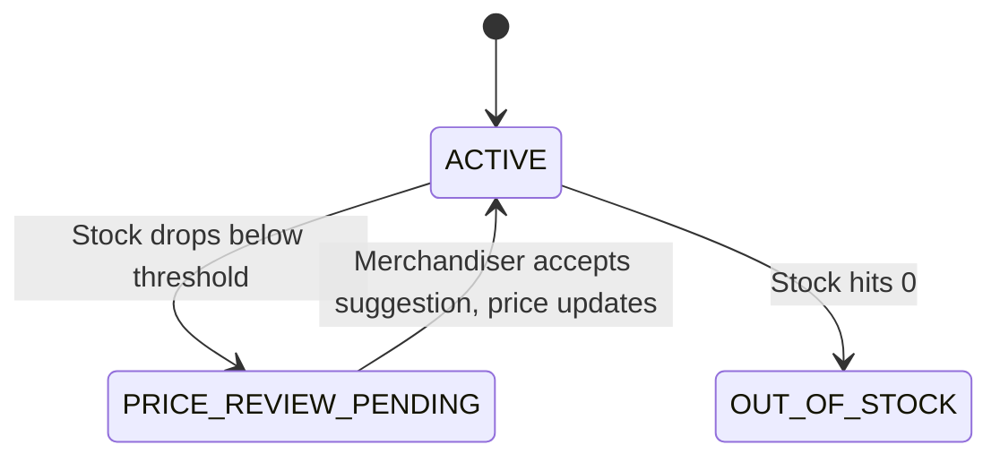

---

### 5.2 Repository Layer — Database Access

Spring Data JPA lets you define database queries **just by writing interface method names**. No SQL needed!

```java
// File: Backend/src/main/java/org/zycus/domain/repository/ProductRepository.java

public interface ProductRepository extends JpaRepository<Product, String> {

    // Spring reads the method name and auto-generates:
    // SELECT * FROM products WHERE status = ?
    List<Product> findByStatus(ProductStatus status);

    // SELECT * FROM products WHERE category = ?
    List<Product> findByCategory(Category category);

    // SELECT * FROM products WHERE status = ? AND category = ?
    List<Product> findByStatusAndCategory(ProductStatus status, Category category);

    // This one uses JPQL (Java Persistence Query Language) for aggregation
    @Query("SELECT AVG(p.demandVelocity) FROM Product p WHERE p.category = :category")
    Double findAverageDemandVelocityByCategory(@Param("category") Category category);
}
```

**How this magic works:**
1. `findByStatus` → Spring parses this as: **find** (query) + **By** (where) + **Status** (the field name).
2. Spring generates SQL at startup and creates a **proxy class** that implements the interface.
3. You never write SQL — just call `productRepository.findByStatus(ProductStatus.ACTIVE)`.

---

### 5.3 Service Layer — Business Logic

The `ProductService` contains the **core business operations**: creating products, updating stock, and simulating orders.

#### The `simulateOrder` Method — The Most Important Method

This is where the **agentic magic happens**. Let's trace through it line by line:

```java
@Transactional  // Everything in this method is ONE atomic database transaction.
                // If anything fails, ALL changes are rolled back.
public Product simulateOrder(String id, int orderQuantity) {
    // 1. Load the product from database
    Product product = getProductById(id);

    // 2. Validate: Can we fulfill this order?
    int currentStock = product.getStockLevel();
    if (currentStock < orderQuantity) {
        throw new IllegalArgumentException("Insufficient stock!");
    }

    // 3. Decrement stock (simulating a sale)
    int updatedStock = currentStock - orderQuantity;
    product.setStockLevel(updatedStock);

    // 4. Increment demand velocity (tracking how "hot" this product is)
    int updatedVelocity = product.getDemandVelocity() + orderQuantity;
    product.setDemandVelocity(updatedVelocity);

    // 5. If stock hit zero → mark out of stock
    if (updatedStock <= 0) {
        product.setStatus(ProductStatus.OUT_OF_STOCK);
    }

    // 6. Save to database
    Product saved = productRepository.save(product);

    // 7. Record an audit trail entry
    inventorySnapshotRepository.save(InventorySnapshot.builder()
        .product(saved)
        .stockLevel(updatedStock)
        .demandVelocity(updatedVelocity)
        .eventType("ORDER_SIMULATED")
        .notes("Order for 2 unit(s). Stock: 45 -> 43, Velocity: 3 -> 5")
        .build());

    // ═══════════════════════════════════════════════════════
    // 8. TRIGGER A: Check if stock fell below safety threshold
    // ═══════════════════════════════════════════════════════
    if (updatedStock < saved.getReorderThreshold()) {
        // Fire a Spring Application Event (non-blocking)
        eventPublisher.publishEvent(
            new StockDepletedEvent(saved.getId(), updatedStock, saved.getReorderThreshold())
        );
        // This event will be picked up by AgenticRecommendationListener
        // ASYNCHRONOUSLY — it doesn't slow down this HTTP response!
    }

    // ═══════════════════════════════════════════════════════
    // 9. TRIGGER B: Check if demand velocity spiked
    // ═══════════════════════════════════════════════════════
    Double categoryAvg = productRepository.findAverageDemandVelocityByCategory(saved.getCategory());
    boolean spikeByMultiplier = updatedVelocity >= (2.5 * categoryAvg);  // 2.5x above peers
    boolean spikeByAbsolute = updatedVelocity >= 10;                      // Or simply >= 10

    if (spikeByMultiplier || spikeByAbsolute) {
        eventPublisher.publishEvent(
            new DemandSpikeEvent(saved.getId(), updatedVelocity, categoryAvg)
        );
    }

    return saved;  // Return the updated product as HTTP response
}
```

**Key Insight**: The HTTP response returns in under 15ms. The AI analysis happens **in the background** via the event system. The customer doesn't wait for AI!

---

### 5.4 Web Layer — Controllers & DTOs

Controllers are **thin** — they only translate HTTP ↔ Java. All logic lives in Services.

```java
@RestController            // This class handles HTTP requests and returns JSON
@RequestMapping("/products") // All endpoints here start with /products
@CrossOrigin(origins = "*") // Allow requests from any frontend origin (CORS)
public class ProductController {

    @GetMapping              // GET /products
    public ResponseEntity<List<Product>> getProducts(
            @RequestParam(required = false) ProductStatus status,    // Optional query param
            @RequestParam(required = false) Category category) {
        return ResponseEntity.ok(productService.getProducts(status, category));
    }

    @PostMapping("/{id}/orders")   // POST /products/PRD-008/orders
    public ResponseEntity<Product> simulateOrder(
            @PathVariable String id,                                 // From the URL path
            @RequestBody SimulateOrderRequest request) {             // From JSON body
        int qty = request.getQuantity() != null ? request.getQuantity() : 1;
        Product updated = productService.simulateOrder(id, qty);
        return ResponseEntity.ok(updated);
    }
}
```

**DTOs (Data Transfer Objects)** are simple classes that define what the API accepts:

```java
public class SimulateOrderRequest {
    private Integer quantity;  // The JSON body: {"quantity": 5}
}
```

**Why DTOs?** They decouple the **API contract** from the **database entity**. If you add a field to `Product`, you don't accidentally expose it in the API.

---

### 5.5 Commerce Engine — Strategy Pattern

This is the most architecturally sophisticated part of the project. It uses the **Strategy Design Pattern** to make the pricing/reorder algorithm **pluggable and swappable at runtime**.

#### 5.5.1 The Interface (Contract)

```java
public interface PricingStrategy {
    String getStrategyName();
    PricingSuggestionResult evaluate(Product product, CommerceContext context);
}
```

Every strategy implementation must follow this contract. The system doesn't care *which* strategy it's using — it just calls `evaluate()`.

#### 5.5.2 Rule-Based Strategy (Simple Deterministic)

```java
@Component("ruleBasedPricingStrategy")
public class RuleBasedPricingStrategy implements PricingStrategy {

    @Override
    public PricingSuggestionResult evaluate(Product product, CommerceContext context) {
        if (stock < threshold) {
            // Rule 1: Low stock → raise price by 10%
            recommendedPrice = currentPrice * 1.10;
            return "INCREASE with 88% confidence";
        }
        else if (velocity > 2x categoryAverage) {
            // Rule 2: High demand → raise price by 5%
            recommendedPrice = currentPrice * 1.05;
            return "INCREASE with 82% confidence";
        }
        else {
            // Rule 3: Everything is normal → keep price
            return "HOLD with 90% confidence";
        }
    }
}
```

#### 5.5.3 AI Strategy (LLM-Powered)

The AI strategy sends product context to an LLM (Gemini, Groq, etc.), receives a JSON response, validates it, and returns the result. If the LLM fails, it falls back to the rule-based strategy.

#### 5.5.4 Strategy Registry — The Hot-Swap Engine

```java
@Component
public class StrategyRegistry {

    // Thread-safe maps of registered strategies
    private final Map<String, PricingStrategy> pricingStrategies = new ConcurrentHashMap<>();

    // Thread-safe reference to currently active strategy
    private final AtomicReference<String> activePricingStrategy = new AtomicReference<>("RULE_BASED");

    // Constructor: Spring auto-discovers all PricingStrategy beans and registers them
    public StrategyRegistry(List<PricingStrategy> pricingList) {
        for (PricingStrategy ps : pricingList) {
            pricingStrategies.put(ps.getStrategyName(), ps);
        }
    }

    // Hot-swap! No restart needed!
    public void setActivePricingStrategy(String name) {
        if (!pricingStrategies.containsKey(name)) {
            throw new IllegalArgumentException("Unknown strategy: " + name);
        }
        activePricingStrategy.set(name);  // Atomic, thread-safe
    }
}
```

**Why `ConcurrentHashMap` and `AtomicReference`?**  
Because multiple HTTP requests may hit the server simultaneously. Regular `HashMap` would cause race conditions. These concurrent data structures guarantee **thread safety**.

---

### 5.6 AI Advisor — LLM Integration

The AI subsystem has 4 components working together:

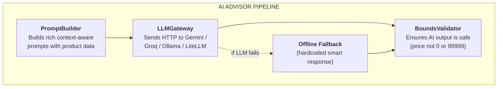

#### 5.6.1 PromptBuilder — Context-Aware Prompt Engineering

The system uses **two distinct prompts** for different scenarios:

**Prompt 1 — Low Stock (Scarcity Analysis):**
```
You are the StockPulse AI Commerce Advisor for ShopStream.
A CRITICAL INVENTORY DEPLETION event has triggered:

[PRODUCT CONTEXT]
- SKU: SKU-APP-001
- Name: Organic Cotton T-Shirt
- Current Price: $24.99
- Stock Level: 8 units
- Reorder Threshold: 15 units
- 24h Velocity: 12 orders
- Category Avg Velocity: 7.5 orders/24h

[ANALYSIS REQUIRED]
1. Stock Preservation vs Clearance: If velocity is high, raise price to
   protect remaining inventory. If near-zero, consider clearance...
```

**Prompt 2 — Demand Spike (Viral Momentum):**
```
A VIRAL DEMAND VELOCITY SURGE has triggered:
...
- Surge Ratio: 3.5x above category benchmark
- Trigger: DEMAND_SPIKE (Viral social conversion surge)

Evaluate: Capitalizing on consumer surplus...
```

**Why two separate prompts?** Because the commercial reasoning is completely different:
- Low stock = "Should we protect remaining inventory or clear it out?"
- Demand spike = "Should we raise prices while the viral wave lasts?"

#### 5.6.2 LLMGateway — Multi-Provider Support

```java
public String callLLM(String prompt) {
    // Guard: If no API key is configured, use offline fallback
    if (apiKey == null || apiKey.isEmpty()) {
        return generateOfflineSimulatedAIResponse(prompt);
    }

    try {
        return switch (provider.toLowerCase()) {
            case "gemini"  -> callGemini(prompt);     // Google's Gemini API
            case "groq"    -> callOpenAICompatible();  // Groq (fast inference)
            case "ollama"  -> callOpenAICompatible();  // Ollama (local models)
            case "litellm" -> callOpenAICompatible();  // LiteLLM proxy
            default        -> callOpenAICompatible();  // Any OpenAI-compatible API
        };
    } catch (Exception ex) {
        // If ANY error occurs, fall back gracefully
        return generateOfflineSimulatedAIResponse(prompt);
    }
}
```

**Key Resilience Feature**: The system **never crashes** even if:
- No API key is set → uses hardcoded smart responses
- LLM is down → catches exception, falls back
- LLM returns garbage → BoundsValidator clamps values to safe ranges

#### 5.6.3 BoundsValidator — AI Safety Guardrails

AI models can sometimes return unreasonable values. The validator ensures safety:

```java
// Price must be between 40% and 300% of current price
BigDecimal minAllowable = currentPrice * 0.40;  // Max 60% discount
BigDecimal maxAllowable = currentPrice * 3.00;  // Max 3x increase

if (aiRecommendedPrice < minAllowable) {
    price = minAllowable;  // Clamp to floor
    reasoning += " [Safety Guard: Clamped to minimum bound]";
}

// Confidence must be between 0.10 and 0.99
confidence = Math.min(0.99, Math.max(0.10, rawConfidence));

// Reorder quantity must be between 1 and 50,000
if (quantity > 50000) quantity = 50000;
```

---

### 5.7 Agentic Loop — Event-Driven Automation

This is the **"agentic" part** — the system that makes decisions **autonomously** without human instruction.

#### 5.7.1 How Spring Events Work

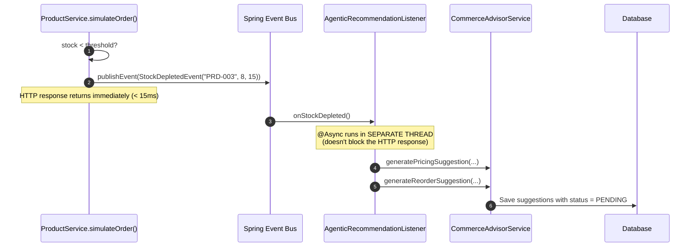

#### 5.7.2 Idempotency Guard — Preventing Duplicate Suggestions

If a customer places 5 quick orders, the system might fire 5 `StockDepletedEvent`s. Without protection, this would create 5 duplicate suggestions.

The solution:

```java
// Check: does a PENDING suggestion already exist for this product + trigger?
boolean pricingPending = pricingSuggestionRepository
    .existsByProductIdAndTriggerReasonAndStatus(
        product.getId(),
        TriggerReason.INVENTORY_LOW,
        SuggestionStatus.PENDING
    );

if (pricingPending && reorderPending) {
    log.info("Suggestions already queued. Skipping duplicate run.");
    return;  // Don't create duplicates!
}
```

#### 5.7.3 Failsafe: Rule-Based Fallback

If the AI strategy throws an exception, the listener **doesn't give up**. It falls back to the rule-based strategy:

```java
try {
    // Try the primary path (might be AI-powered)
    commerceAdvisorService.generatePricingSuggestion(product, ...);
} catch (Exception ex) {
    // AI failed? No problem. Fall back to deterministic rules.
    executeFailsafe(product, TriggerReason.INVENTORY_LOW, ...);
}
```

---

### 5.8 SSE Streaming — Real-Time AI Output

**Server-Sent Events (SSE)** allow the backend to **push** data to the frontend in real-time — no polling needed.

```java
@PostMapping(value = "/products/{id}/suggest-pricing/stream",
             produces = MediaType.TEXT_EVENT_STREAM_VALUE)
public SseEmitter streamPricingSuggestion(@PathVariable String id) {
    SseEmitter emitter = new SseEmitter(60_000L); // 60-second timeout

    CompletableFuture.runAsync(() -> {
        // Step 1: Send status message
        emitter.send(event().name("status").data("Initializing AI Advisor..."));

        // Step 2: Stream individual words (simulating token-by-token LLM output)
        String reasoning = "Evaluating SKU 'T-Shirt'. Current inventory is 8 units...";
        for (String word : reasoning.split(" ")) {
            emitter.send(event().name("token").data(word + " "));
            Thread.sleep(80);  // 80ms delay per token (realistic LLM speed)
        }

        // Step 3: Generate and save the final suggestion
        PricingSuggestion suggestion = commerceAdvisorService.generatePricingSuggestion(...);

        // Step 4: Send the complete result
        emitter.send(event().name("complete").data(suggestion));
        emitter.complete();
    });

    return emitter;
}
```

**The stream format (what the browser receives):**
```
event: status
data: {"message":"Initializing StockPulse AI Commerce Advisor for SKU SKU-APP-001..."}

event: token
data: {"content":"Evaluating "}

event: token
data: {"content":"SKU "}

event: token
data: {"content":"'Organic Cotton T-Shirt'. "}

...

event: complete
data: {"suggestion":{"id":15,"recommendedPrice":27.49,...}}
```

---

### 5.9 Configuration & Data Seeding

#### 5.9.1 Application Properties

```properties
# Server
server.port=8080

# H2 In-Memory Database (zero configuration!)
spring.datasource.url=jdbc:h2:mem:stockpulse;DB_CLOSE_DELAY=-1
spring.jpa.hibernate.ddl-auto=update    # Auto-create tables from @Entity classes

# LLM Configuration (from environment variables, with fallback defaults)
llm.provider=${LLM_PROVIDER:litellm}    # If LLM_PROVIDER env var not set, use "litellm"
llm.api-key=${LLM_API_KEY:}             # If not set, empty (triggers offline fallback)

# Agentic Trigger Thresholds
stockpulse.triggers.demand-spike-multiplier=2.5    # Velocity > 2.5x average triggers spike
stockpulse.triggers.demand-spike-absolute-threshold=10  # Or velocity >= 10 triggers spike
```

#### 5.9.2 DataInitializer — Seed Data

When the application starts, `DataInitializer` runs and inserts **8 products** into the database:

| ID | Name | Category | Price | Stock | Threshold | Velocity | Status |
|---|---|---|---|---|---|---|---|
| PRD-001 | Wireless Earbuds Pro | ELECTRONICS | $79.99 | 45 | 20 | 3 | ACTIVE |
| PRD-002 | USB-C Hub 7-Port | ELECTRONICS | $34.99 | 120 | 30 | 1 | ACTIVE |
| PRD-003 | Organic Cotton T-Shirt | APPAREL | $24.99 | **8** | **15** | 12 | **PRICE_REVIEW_PENDING** |
| PRD-004 | Running Shorts — Navy | APPAREL | $39.99 | 55 | 20 | 2 | ACTIVE |
| PRD-005 | Ceramic Pour-Over Set | HOME | $49.99 | 22 | 10 | 4 | ACTIVE |
| PRD-006 | LED Desk Lamp | HOME | $59.99 | **0** | 15 | 0 | **OUT_OF_STOCK** |
| PRD-007 | Portable Charger 20K | ELECTRONICS | $44.99 | **18** | **25** | 8 | ACTIVE |
| PRD-008 | Hoodie — Heather Grey | APPAREL | $54.99 | 11 | 12 | 15 | ACTIVE |

Notice **PRD-003** is pre-configured with stock below threshold (8 < 15) and has pre-seeded PENDING suggestions — so the demo works immediately on first load!

---

## 6. Frontend Deep Dive

### 6.1 React Architecture & Component Tree

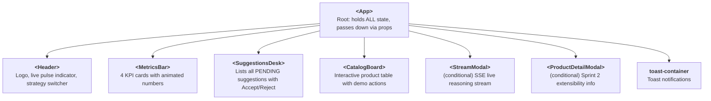

### 6.2 State Management & Polling

The `App.jsx` component manages ALL application state using React's `useState` hook:

```jsx
export default function App() {
  // Core data state
  const [products, setProducts] = useState([]);               // All 8 products
  const [pricingSuggestions, setPricingSuggestions] = useState([]); // PENDING pricing suggestions
  const [reorderSuggestions, setReorderSuggestions] = useState([]); // PENDING reorder suggestions
  const [strategyConfig, setStrategyConfig] = useState(null);      // Current strategy settings

  // UI state
  const [isRefreshing, setIsRefreshing] = useState(false);     // Spinner for manual refresh
  const [actionLoadingId, setActionLoadingId] = useState(null); // Which product button is loading
  const [activeStreamProduct, setActiveStreamProduct] = useState(null); // SSE modal target
  const [toasts, setToasts] = useState([]);                    // Notification queue

  // ═══════════════════════════════════════════════════
  // AUTONOMOUS POLLING LOOP — Every 3 seconds
  // ═══════════════════════════════════════════════════
  useEffect(() => {
    loadData();                                    // Initial load
    const interval = setInterval(() => {
      loadData(false);                             // Silent background refresh
    }, 3000);                                      // Every 3 seconds
    return () => clearInterval(interval);          // Cleanup on unmount
  }, [loadData]);

  // loadData fetches ALL endpoints in PARALLEL
  const loadData = async (isManual = false) => {
    const [prods, pricing, reorders, config] = await Promise.all([
      fetchProducts(),                             // GET /products
      fetchPricingSuggestions(null, 'PENDING'),     // GET /pricing-suggestions?status=PENDING
      fetchReorderSuggestions(null, 'PENDING'),     // GET /reorder-suggestions?status=PENDING
      fetchStrategyConfig()                        // GET /api/config/strategy
    ]);
    setProducts(prods);
    setPricingSuggestions(pricing);
    setReorderSuggestions(reorders);
    setStrategyConfig(config);
  };
}
```

**Why `Promise.all`?** Instead of 4 sequential API calls (800ms total), we make all 4 **simultaneously** (~200ms total).

### 6.3 API Service Layer

All HTTP calls are centralized in `services/api.js`. This is a **facade pattern** — components never call `fetch()` directly.

```javascript
const BASE_URL = 'http://localhost:8080';

// Simple GET request
export async function fetchProducts(status = null, category = null) {
  const params = new URLSearchParams();
  if (status) params.append('status', status);
  if (category) params.append('category', category);

  const res = await fetch(`${BASE_URL}/products?${params.toString()}`);
  if (!res.ok) throw new Error(`Failed: ${res.statusText}`);
  return res.json();
}

// SSE Stream reader using ReadableStream API
export async function streamPricingReasoning(productId, callbacks) {
  const response = await fetch(`${BASE_URL}/products/${productId}/suggest-pricing/stream`, {
    method: 'POST',
    headers: { 'Accept': 'text/event-stream' }
  });

  const reader = response.body.getReader();
  const decoder = new TextDecoder('utf-8');
  let buffer = '';

  while (true) {
    const { done, value } = await reader.read();
    if (done) break;

    buffer += decoder.decode(value, { stream: true });
    // Parse SSE events from the buffer...
    // Call callbacks.onToken("word") for each token
    // Call callbacks.onComplete(suggestion) when done
  }
}
```

### 6.4 Component Breakdown

#### **Header** — Strategy Switcher
- Displays a green pulsating dot indicating the system is live
- Dropdown to switch between `RULE_BASED`, `AI`, and `COMPETITOR_AWARE` strategies
- Manual refresh button with spinning animation while loading

#### **MetricsBar** — KPI Dashboard
- **Pending Actions**: Count of suggestions awaiting review
- **Low Stock Triggers**: Products where `stock < threshold`
- **Demand Spikes**: Products where `velocity >= 8`
- **Catalog SKUs**: Total product count

#### **SuggestionsDesk** — The Decision Center
- Lists all PENDING pricing and reorder suggestions
- Shows trigger badges (🔶 INVENTORY_LOW, 🟣 DEMAND_SPIKE)
- Confidence bar (visual progress bar 0-100%)
- AI reasoning text
- **Accept** button → calls `PATCH /pricing-suggestions/{id}` with `{"status":"ACCEPTED"}`
- **Reject** button → calls `PATCH /pricing-suggestions/{id}` with `{"status":"REJECTED"}`

#### **CatalogBoard** — Interactive Product Table
- Category filter pills (ALL, ELECTRONICS, APPAREL, HOME)
- Stock level color-coded progress bars (red if below threshold)
- Velocity flame badge 🔥 if velocity > 8
- Demo action buttons per row:
  - `🛒 -1 Sale` → `POST /products/{id}/orders` with `{quantity: 1}`
  - `🔥 +5 Viral` → `POST /products/{id}/orders` with `{quantity: 5}`
  - `📦 +20 Restock` → `PATCH /products/{id}/stock` with `{stockLevel: current + 20}`
  - `⚡ Stream AI` → Opens SSE modal

#### **StreamModal** — Live AI Token Streaming
- Connects to `POST /products/{id}/suggest-pricing/stream`
- Displays tokens with typewriter animation as they arrive
- Shows final suggestion when stream completes

---

## 7. Design Patterns Used

| Pattern | Where | Why |
|---|---|---|
| **Strategy Pattern** | `PricingStrategy`, `ReorderStrategy`, `StrategyRegistry` | Swap algorithms at runtime without changing code |
| **Observer/Event Pattern** | Spring `ApplicationEventPublisher` + `@EventListener` | Decouple order processing from recommendation generation |
| **Builder Pattern** | Lombok `@Builder` on entities | Clean construction of complex objects |
| **Facade Pattern** | `CommerceAdvisorService`, `api.js` | Simplified interface hiding complex subsystems |
| **Repository Pattern** | Spring Data JPA repositories | Abstract database access behind interfaces |
| **DTO Pattern** | `CreateProductRequest`, `UpdateStockRequest`, etc. | Decouple API layer from domain model |
| **Fallback Pattern** | `LLMGateway` offline response, `AgenticRecommendationListener` failsafe | Graceful degradation when external services fail |
| **Singleton Pattern** | `StrategyRegistry` (Spring `@Component` = singleton by default) | One shared registry instance |
| **Template Method** | `@PrePersist` / `@PreUpdate` hooks | JPA lifecycle callbacks |

---

## 8. Data Flow Walkthroughs

### 8.1 Flow 1: Customer Places an Order → Automatic AI Suggestion

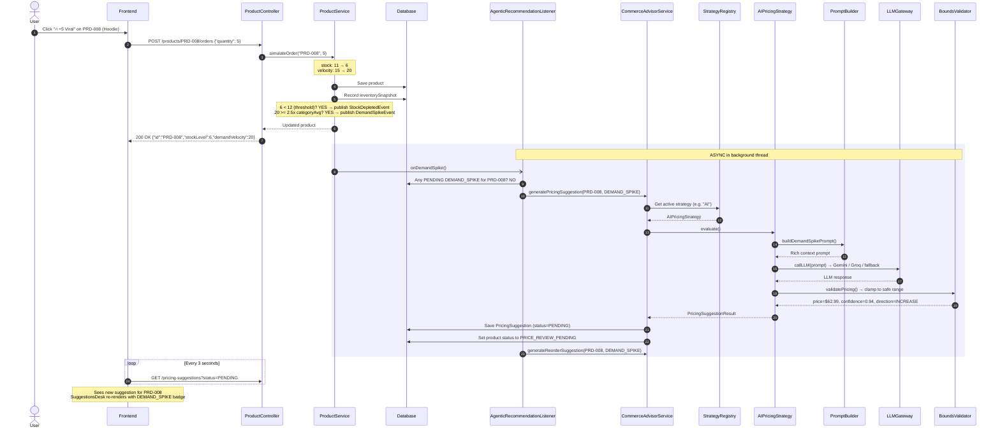

### 8.2 Flow 2: Merchandiser Accepts a Pricing Suggestion

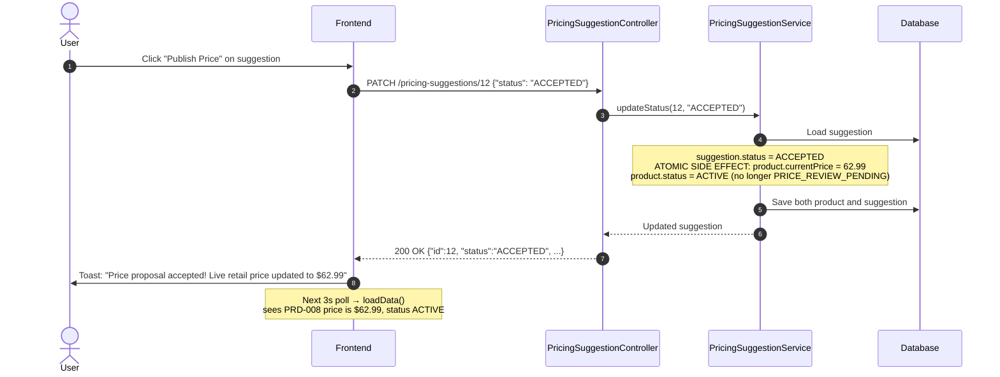

### 8.3 Flow 3: SSE Token Streaming

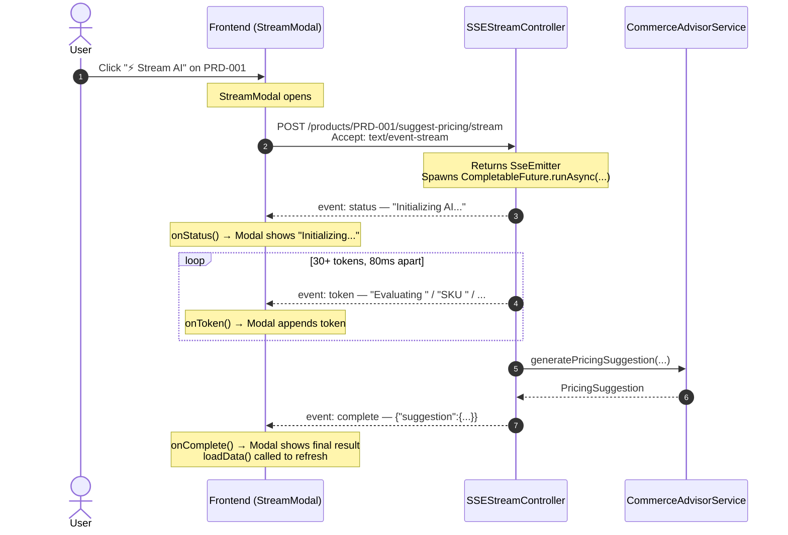

### 8.4 Flow 4: Runtime Strategy Switching

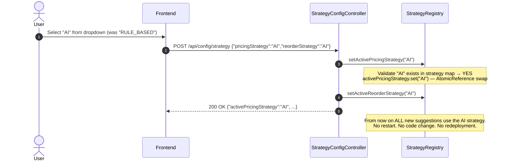

---

## 9. Key Concepts Explained for Beginners

### 9.1 What is Spring Boot?

Spring Boot is a **framework that eliminates boilerplate**. Without it, setting up a web server in Java requires ~50 lines of XML configuration. With Spring Boot:
```java
@SpringBootApplication  // One annotation = web server + database + dependency injection
public class BackendApplication {
    public static void main(String[] args) {
        SpringApplication.run(BackendApplication.class, args);  // That's it. Server starts.
    }
}
```

### 9.2 What is Dependency Injection?

Instead of creating objects manually:
```java
// ❌ Without DI (tight coupling)
public class ProductController {
    private ProductService service = new ProductService(
        new ProductRepository(),
        new InventorySnapshotRepository(),
        new ApplicationEventPublisher()
    );
}
```

Spring **injects** them for you:
```java
// ✅ With DI (loose coupling)
@RequiredArgsConstructor  // Lombok generates the constructor
public class ProductController {
    private final ProductService productService;  // Spring creates and injects this
}
```

### 9.3 What is `@Transactional`?

It ensures **atomicity** — either ALL database operations succeed, or NONE do:

```java
@Transactional
public void acceptPricingSuggestion(Long id) {
    suggestion.setStatus(ACCEPTED);                          // DB write 1
    product.setCurrentPrice(suggestion.getRecommendedPrice()); // DB write 2
    product.setStatus(ACTIVE);                               // DB write 3
    // If any of these fail, ALL 3 are rolled back.
    // You never get a partially updated state.
}
```

### 9.4 What is `@Async`?

It makes a method run in a **separate thread**:

```java
@Async
@EventListener
public void onStockDepleted(StockDepletedEvent event) {
    // This runs in a background thread from a thread pool.
    // The original HTTP request that fired the event
    // has ALREADY returned to the client.
}
```

### 9.5 What is an SseEmitter?

SSE (Server-Sent Events) is a **one-way channel** from server to client:
- HTTP response never "ends" — the connection stays open
- Server pushes events whenever it wants
- Client receives them in real-time
- Unlike WebSocket, SSE is HTTP-native (works through proxies, load balancers)

### 9.6 What is the Strategy Pattern?

Imagine you have 3 different algorithms for the same job (calculating a price recommendation). Instead of if/else:

```java
// ❌ Bad: Hard to add new strategies, violates Open/Closed Principle
if (strategy.equals("RULE_BASED")) {
    price = currentPrice * 1.10;
} else if (strategy.equals("AI")) {
    price = callLLM();
} else if (strategy.equals("COMPETITOR_AWARE")) {
    price = matchCompetitor();
}
```

You use **polymorphism**:

```java
// ✅ Good: Each strategy is its own class. Adding a new one = new file only.
PricingStrategy strategy = strategyRegistry.getActivePricingStrategy();
PricingSuggestionResult result = strategy.evaluate(product, context);
// The registry returns whatever strategy is currently active.
// The calling code doesn't know or care WHICH strategy it is!
```

### 9.7 What is React's `useEffect`?

`useEffect` is a React hook for **side effects** — things that happen outside of rendering (API calls, timers, subscriptions):

```jsx
useEffect(() => {
    // This runs AFTER the component renders
    loadData();                              // Fetch data from API
    const interval = setInterval(() => {
        loadData(false);                     // Poll every 3 seconds
    }, 3000);

    return () => clearInterval(interval);    // Cleanup when component unmounts
}, [loadData]);                              // Re-run if loadData changes
```

### 9.8 What is `useCallback`?

`useCallback` **memoizes** a function so it's not recreated on every render:

```jsx
const loadData = useCallback(async () => {
    // This function reference stays STABLE across re-renders
    // Without useCallback, useEffect would see a "new" function every render
    // and would re-run infinitely
}, []);
```

---

## 10. Database Schema Explained

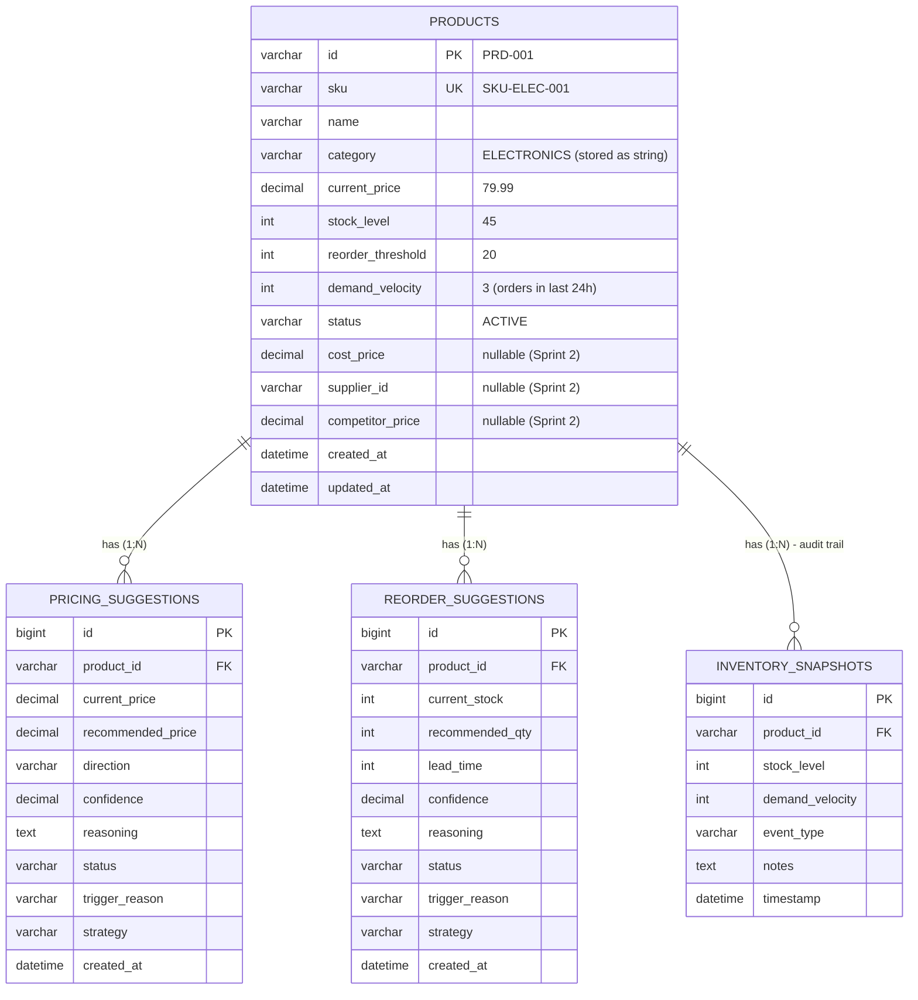

> **Audit trail:** `INVENTORY_SNAPSHOTS` records every stock change.

---

## 11. API Endpoints Reference

| Method | Endpoint | Purpose | Request Body |
|---|---|---|---|
| `GET` | `/products` | List all products | Query: `?status=ACTIVE&category=ELECTRONICS` |
| `GET` | `/products/{id}` | Get single product | — |
| `POST` | `/products` | Create new product | `CreateProductRequest` JSON |
| `PATCH` | `/products/{id}/stock` | Update stock level | `{"stockLevel": 10}` |
| `POST` | `/products/{id}/orders` | Simulate customer order | `{"quantity": 5}` |
| `POST` | `/products/{id}/suggest-pricing` | On-demand price recommendation | — |
| `POST` | `/products/{id}/suggest-reorder` | On-demand reorder recommendation | — |
| `POST` | `/products/{id}/suggest-pricing/stream` | SSE live token stream | — |
| `GET` | `/pricing-suggestions` | List pricing suggestions | Query: `?status=PENDING&productId=PRD-003` |
| `PATCH` | `/pricing-suggestions/{id}` | Accept/Reject pricing | `{"status": "ACCEPTED"}` |
| `GET` | `/reorder-suggestions` | List reorder suggestions | Query: `?status=PENDING` |
| `PATCH` | `/reorder-suggestions/{id}` | Accept/Reject reorder | `{"status": "ACCEPTED"}` |
| `GET` | `/api/config/strategy` | Get current strategy config | — |
| `POST` | `/api/config/strategy` | Switch strategies at runtime | `{"pricingStrategy":"AI","reorderStrategy":"AI"}` |

---

## 12. How to Run the Project

### Prerequisites
- **Java 21+** — `java -version`
- **Node.js 18+** — `node -v`
- **npm** — `npm -v`

### Step 1: Start the Backend

```powershell
# From the project root
cd Backend
.\mvnw.cmd spring-boot:run
```

Wait for: `Started BackendApplication in X seconds`  
Backend is now at: `http://localhost:8080`  
H2 Console: `http://localhost:8080/h2-console` (JDBC URL: `jdbc:h2:mem:stockpulse`, Username: `sa`, Password: empty)

### Step 2: Start the Frontend

```powershell
# Open a SECOND terminal
cd frontend
npm install       # First time only
npm run dev
```

Frontend is now at: `http://localhost:5173`

### Step 3: Try the Demo

1. Open `http://localhost:5173` — you'll see the dashboard with 8 products
2. Look at the **Merchandising Decision Desk** — PRD-003 has a pre-seeded PENDING suggestion
3. Click **"Publish Price"** — watch the price update instantly
4. Click **"🔥 +5 Viral"** on PRD-008 — watch a new suggestion appear in ~3 seconds
5. Click **"⚡ Stream AI"** on any product — watch live AI token streaming

---

## 13. Interview-Ready Talking Points

### "Tell me about this project."

> "StockPulse is an agentic reactive commerce advisor. It uses an Observe-Reason-Act-Checkpoint loop: when inventory signals change (stock drops below threshold or demand surges), the system autonomously generates pricing and reorder recommendations using either deterministic rules or LLM-powered AI analysis. Recommendations are queued for human approval before any live prices or stock levels change."

### "What design patterns did you use?"

> "Strategy Pattern for pluggable pricing engines with runtime switching, Observer Pattern via Spring Events for decoupling order processing from recommendation generation, Builder Pattern via Lombok for entity construction, and Facade Pattern for the API service layer."

### "How does the agentic loop work?"

> "When a simulateOrder() call updates stock, the service checks two triggers: (1) Is stock below the reorder threshold? (2) Is demand velocity above 2.5x the category average? If either condition is met, a Spring Application Event is published. An @Async @EventListener picks up the event in a background thread, checks an idempotency guard to prevent duplicates, then invokes the active commerce strategy to generate and persist PENDING suggestions. The HTTP response returns immediately while AI processing happens asynchronously."

### "How do you handle LLM failures?"

> "Three layers of resilience: (1) If no API key is configured, the LLMGateway returns a hardcoded intelligent offline response. (2) If the LLM call throws an exception, the gateway catches it and falls back to the offline response. (3) Even if the AI strategy itself fails, the AgenticRecommendationListener catches the exception and falls back to the deterministic rule-based strategy. The system never crashes, and recommendations are always generated."

### "Why H2 instead of MySQL?"

> "For the hackathon demo, H2 provides zero-configuration instant boot — no database server to install, no connection strings to configure. The schema is auto-generated from JPA annotations. MySQL support is already in place via a Spring profile (application-mysql.properties), ready for production."

### "How does runtime strategy switching work?"

> "The StrategyRegistry uses ConcurrentHashMap for thread-safe strategy lookup and AtomicReference for the active strategy key. When a merchandiser calls POST /api/config/strategy, the registry atomically swaps the active reference. The next evaluate() call picks up the new strategy immediately. No restart, no code change, no redeployment."

---

## 14. Glossary

| Term | Definition |
|---|---|
| **Agentic** | Autonomous decision-making capability — the system acts on its own based on triggers |
| **SKU** | Stock Keeping Unit — unique product identifier |
| **Demand Velocity** | Number of orders in the last 24 hours |
| **Reorder Threshold** | Minimum stock level below which a restocking alert fires |
| **SSE** | Server-Sent Events — HTTP-based one-way push from server to client |
| **Strategy Pattern** | Design pattern where algorithms are encapsulated in separate classes, swappable at runtime |
| **Idempotency** | Ensuring an operation produces the same result even if called multiple times |
| **DTO** | Data Transfer Object — lightweight class for API payloads |
| **JPA** | Java Persistence API — standard for mapping Java objects to database tables |
| **CORS** | Cross-Origin Resource Sharing — allows frontend on port 5173 to call backend on port 8080 |
| **LLM** | Large Language Model — AI model for text generation (Gemini, GPT, etc.) |
| **SseEmitter** | Spring class for sending Server-Sent Events |
| **AtomicReference** | Thread-safe container for a mutable reference (used in StrategyRegistry) |
| **ConcurrentHashMap** | Thread-safe HashMap implementation for concurrent access |
| **BigDecimal** | Java class for precise decimal arithmetic (critical for financial calculations) |
| **Lombok** | Java library that auto-generates boilerplate (getters, setters, builders, constructors) |
| **@Transactional** | Spring annotation ensuring all database operations in a method are atomic |
| **@Async** | Spring annotation causing a method to run in a separate background thread |
| **@EventListener** | Spring annotation marking a method as a handler for application events |
| **Hot-swap** | Changing behavior at runtime without restarting the application |
| **Bounds Validation** | Clamping AI-generated values to safe ranges (e.g., price between 0.4x and 3x current) |

---

> **📌 Tip**: The best way to learn this project is to **run it**, click every button, and watch the server logs (`mvnw spring-boot:run` shows all the event processing in real-time). The logs use `@Slf4j` and print exactly which triggers fire, which strategies are used, and which suggestions are generated.

---

*Created for learning. Every line of this project is designed to teach modern full-stack development patterns.*
